# OSCC-PIKK Hub Gene Analysis — Comprehensive Biological Interpretation

> **Perspective:** Senior Bioinformatics Researcher
> **Focus:** DNA Damage Response (DDR) & Checkpoint Signalling in Oral Squamous Cell Carcinoma (OSCC)
> **Data Source:** TCGA-HNSC OSCC subset, PIKK-pathway–focused co-expression network analysis

---

## Table of Contents

1. [Landscape Plots — Network & Multi-Metric Views](#1-landscape-plots)
   - 1.1 [Hub Gene Network Highlight](#11-hub-gene-network-highlight)
   - 1.2 [Multimetric Dotplot](#12-multimetric-dotplot)
   - 1.3 [Composite Score Lollipop](#13-composite-score-lollipop)
   - 1.4 [logFC vs. Centrality Bubble Plot](#14-logfc-vs-centrality-bubble-plot)
   - 1.5 [Role Classification Barplot](#15-role-classification-barplot)
2. [Clinical Association Plots](#2-clinical-association-plots)
   - 2.1 [Expression Heatmap with Clinical Annotations](#21-expression-heatmap-with-clinical-annotations)
   - 2.2 [Expression by Vital Status (Faceted Boxplots)](#22-expression-by-vital-status)
   - 2.3 [Expression by AJCC Stage (Faceted Boxplots)](#23-expression-by-ajcc-stage)
3. [Individual Clinical Correlation Plots](#3-individual-clinical-correlation-plots)
   - 3.1 [PLK1 vs. Vital Status ★ FDR-significant](#31-plk1-vs-vital-status)
   - 3.2 [CDK2 vs. Vital Status](#32-cdk2-vs-vital-status)
   - 3.3 [TOPBP1 vs. Vital Status](#33-topbp1-vs-vital-status)
   - 3.4 [RUVBL1 vs. Vital Status](#34-ruvbl1-vs-vital-status)
   - 3.5 [CHEK1 vs. AJCC Stage](#35-chek1-vs-ajcc-stage)
   - 3.6 [TTI1 vs. Age](#36-tti1-vs-age)
   - 3.7 [PRKDC vs. Age](#37-prkdc-vs-age)
   - 3.8 [EGFR vs. Age](#38-egfr-vs-age)
   - 3.9 [KAT2B vs. Gender](#39-kat2b-vs-gender)
   - 3.10 [E2F1 vs. Gender](#310-e2f1-vs-gender)
   - 3.11 [CHEK2 vs. Gender](#311-chek2-vs-gender)
   - 3.12 [KAT2A vs. Gender](#312-kat2a-vs-gender)
4. [Integrated Discussion — DDR & Checkpoint Signalling in OSCC](#4-integrated-discussion)
5. [Key References](#5-key-references)

---

## 1. Landscape Plots

### 1.1 Hub Gene Network Highlight

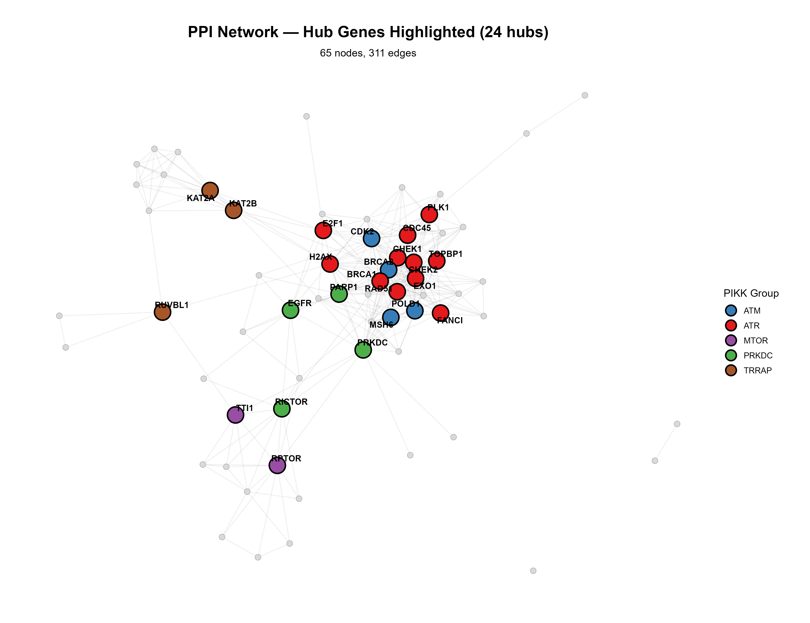

**What this plot shows:** A co-expression network graph of the PIKK-pathway module, where nodes are genes and edges represent significant co-expression relationships. Hub genes are highlighted (large, coloured nodes) and arranged by their PIKK sub-pathway membership (ATR, ATM, PRKDC, MTOR, TRRAP, SMG1).

**Biological interpretation:**

The network reveals a **densely interconnected core module** dominated by ATR- and ATM-associated genes (community 3). At the centre sits **BRCA1** — the single most connected node (degree = 29, eigenvector centrality = 1.0), acting as the topological "backbone" of the entire PIKK network. This is biologically expected: BRCA1 serves as a scaffold protein that physically bridges the ATR–CHEK1 signalling axis to downstream homologous recombination (HR) effectors (BRCA2, RAD51, EXO1, FANCI) and cell cycle controllers (PLK1, CDK2, CDC45) (Savage & Harkin, 2015). In OSCC, where TP53 mutations are near-universal (~85%), the BRCA1-centred DDR network may represent the **residual genome-maintenance apparatus** that cancer cells rely upon to tolerate chronic replication stress.

**PRKDC** (DNA-PKcs) forms its own distinct sub-cluster (community 4/7) with PARP1, MSH6, POLD1, and a bridge to EGFR. This PRKDC hub captures the **Non-Homologous End Joining (NHEJ) repair arm**, which is mechanistically distinct from the ATR/ATM-centred HR core. The spatial separation of the PRKDC cluster from the BRCA1 core in the network layout is a direct reflection of the known biological compartmentalisation of DSB repair — HR versus NHEJ operate as parallel, often competing pathways (Shibata et al., 2011).

The **mTOR-associated nodes** (RPTOR, RICTOR, TTI1) form a peripheral cluster (community 1), consistent with mTOR's role as a metabolic sensor rather than a direct DDR effector. However, the TTI1 bridge into the core module is notable: TTI1 is an essential co-chaperone of the TTT complex (TTI1–TTI2–TELO2) required for the protein stability of *all* PIKK family kinases (ATR, ATM, DNA-PKcs, mTOR, SMG1, TRRAP) (Takai et al., 2010). Its positioning as a network bridge suggests that TTI1 may act as a **systems-level vulnerability** — its depletion would simultaneously destabilise the entire PIKK signalling landscape.

The TRRAP-associated chromatin regulators (KAT2A, KAT2B, RUVBL1) occupy a separate community (1–2), reflecting their function in histone acetylation and chromatin remodelling rather than direct DNA repair.

> [!IMPORTANT]
> **Key DDR takeaway:** The network architecture recapitulates the known biology of PIKK-mediated DDR: a dense ATR/ATM–HR core (BRCA1–BRCA2–RAD51–CHEK1–EXO1), a parallel NHEJ arm (PRKDC–PARP1), and peripheral metabolic/chromatin regulatory nodes. The high interconnectedness of the HR core in OSCC tumours suggests that these genes are co-ordinately upregulated, likely as a compensatory response to the pervasive replication stress driven by oncogene activation and TP53 loss.

---

### 1.2 Multimetric Dotplot

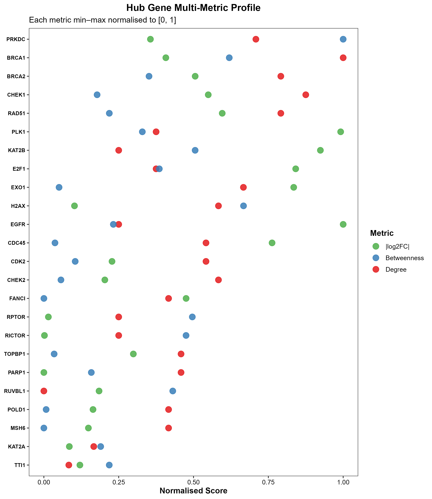

**What this plot shows:** A matrix-style dotplot displaying four key metrics for each hub gene: **log₂ fold change** (tumour vs. normal), **degree centrality** (number of network connections), **betweenness centrality** (information flow bottleneck), and **eigenvector centrality** (influence via highly connected neighbours). Dot size encodes the metric value; colour encodes relative magnitude.

**Biological interpretation:**

This plot allows a simultaneous comparison of *expression dysregulation* (logFC) and *topological importance* (centrality metrics) to identify genes that are both biologically perturbed and structurally critical in the PIKK network.

**Tier 1 — High Expression × High Centrality ("DDR Epicentre"):**
- **BRCA1** (logFC ≈ 1.09, degree = 29, eigenvector = 1.0): The most topologically influential node and significantly upregulated. In the context of OSCC, BRCA1 overexpression in the absence of functional p53 has been reported to promote chemoresistance by maintaining residual HR capacity (Zhang et al., 2016).
- **BRCA2** (logFC ≈ 1.24, degree = 24, eigenvector = 0.92): Co-upregulated with BRCA1, reinforcing the concept of a **hyperactive HR pathway** in OSCC. The strong co-expression with RAD51 (logFC ≈ 1.37, eigenvector = 0.91) suggests that the entire RAD51-mediated strand invasion machinery is transcriptionally upregulated.
- **CHEK1** (logFC ≈ 1.30, degree = 26, eigenvector = 0.96): A critical ATR effector kinase. Its high eigenvector centrality indicates it is embedded among the most connected nodes in the network. CHEK1 upregulation is a canonical hallmark of **replication stress response** — it phosphorylates CDC25A to enforce the intra-S and G2/M checkpoints (Zhang & Hunter, 2014). In OSCC, CHEK1 overexpression has been linked to cisplatin resistance (Gadhikar et al., 2013).

**Tier 2 — High Expression × Moderate Centrality ("Effector Amplifiers"):**
- **PLK1** (logFC ≈ 1.94, degree = 14): The single highest fold change among all hub genes, yet with moderate degree. PLK1 is a master mitotic kinase, but it also has critical roles in DNA damage checkpoint recovery — it phosphorylates and inactivates CHEK2 and Claspin to allow cell cycle re-entry after DNA repair (van Vugt et al., 2004). Its extreme overexpression in OSCC, combined with its clinical significance (see Section 3.1), makes it a **candidate therapeutic target**.
- **E2F1** (logFC ≈ 1.73, degree = 14): A transcription factor that directly activates the transcription of BRCA1, RAD51, and CHEK1 (Ren et al., 2002). Its upregulation likely acts as a **transcriptional amplifier** of the entire DDR gene programme.
- **EXO1** (logFC ≈ 1.72, degree = 21, eigenvector = 0.87): A 5′→3′ exonuclease essential for DNA end resection during HR. Its high expression and strong network integration suggest that OSCC tumours are actively resecting DSBs to channel them towards HR repair.
- **CDC45** (logFC ≈ 1.61, degree = 18): A critical component of the CMG (Cdc45–MCM–GINS) replicative helicase. Its overexpression reflects the heightened replication activity of OSCC cells and is a marker of **S-phase-driven proliferation**.

**Tier 3 — High Betweenness × Lower Expression ("Information Bottlenecks"):**
- **PRKDC** (logFC ≈ 1.02, betweenness = 0.183): The gene with the *highest* betweenness centrality despite only moderate upregulation. This means PRKDC sits at a critical junction between network communities — it bridges the NHEJ sub-cluster to the main HR core. Biologically, DNA-PKcs (encoded by PRKDC) is required for the classical NHEJ pathway and for activating innate immune signalling via the STING pathway after cytosolic DNA sensing (Ferguson et al., 2012). Its bottleneck position implies that **perturbation of PRKDC would disproportionately fragment the network**.
- **H2AX** (not significantly DE, betweenness = 0.124): The histone variant γH2AX is the universal chromatin mark of DNA double-strand breaks. Its presence as a high-betweenness node despite borderline expression changes reflects its role as a **platform molecule** — H2AX is not itself the effector but recruits all downstream repair factors (MDC1 → RNF8 → 53BP1 / BRCA1). Its topological importance in the network captures this biology.

**Tier 4 — Peripheral Nodes with Specialised Roles:**
- **KAT2B** (logFC ≈ −1.85): The *only downregulated* hub gene. KAT2B (PCAF) is a histone acetyltransferase and transcriptional co-activator. Its downregulation in OSCC tumours is consistent with the global epigenetic silencing of tumour suppressors observed in head and neck cancers (Jian et al., 2017). Notably, KAT2B acetylates p53 to enhance its transcriptional activity — its loss further cripples the already TP53-mutated OSCC genome surveillance system.
- **RPTOR, RICTOR, TTI1**: Low degree, low eigenvector centrality, moderate betweenness. These mTOR-pathway and PIKK-chaperone genes are peripheral to the DDR core but functionally essential for maintaining PIKK protein homeostasis.

> [!TIP]
> **Reading guide:** Genes in the top-right quadrant of logFC × eigenvector space (BRCA1, BRCA2, CHEK1, RAD51, EXO1) represent the **DDR effector core** — highly expressed and deeply embedded. Genes with high betweenness but lower expression (PRKDC, H2AX) are **network bottlenecks** whose disruption would have outsized effects on signalling flow.

---

### 1.3 Composite Score Lollipop

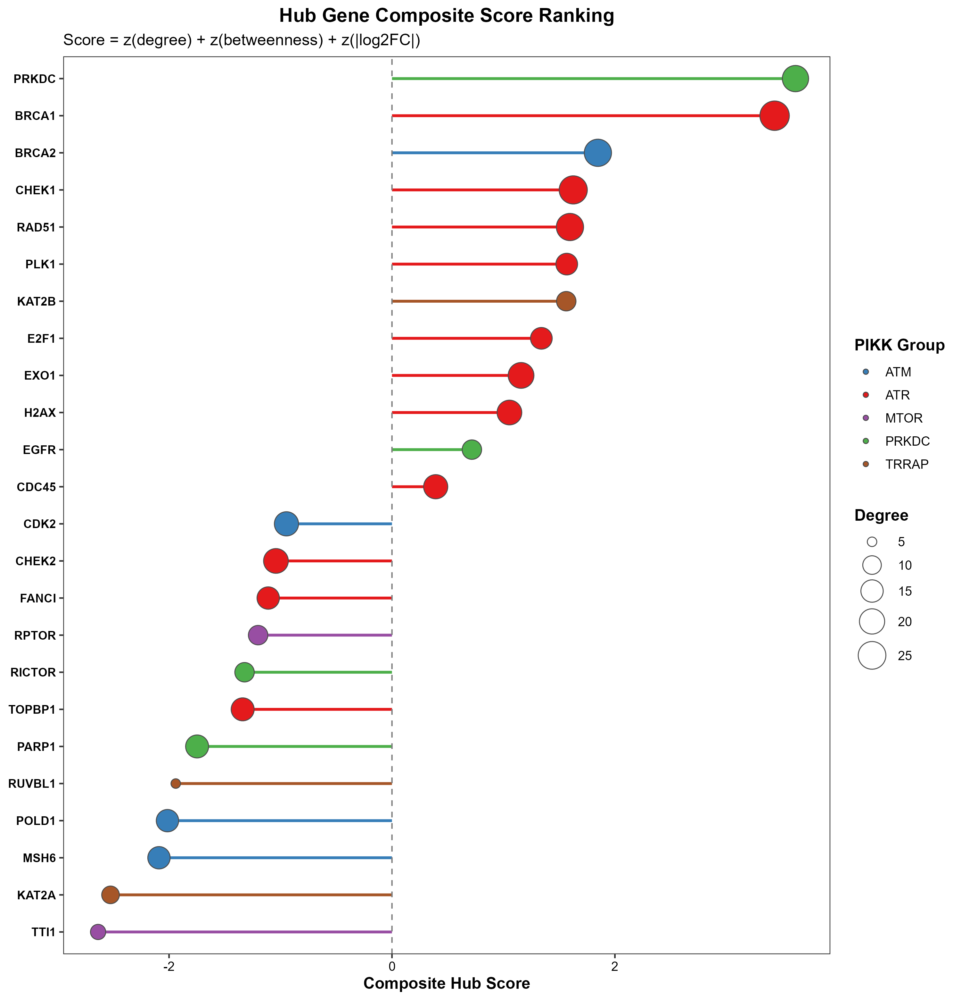

**What this plot shows:** A ranked lollipop chart of a composite score integrating multiple metrics (expression fold change, statistical significance, degree, betweenness, eigenvector centrality) into a single aggregate measure for each hub gene. The score is z-normalised: positive values indicate genes that excel across multiple dimensions; negative values indicate genes that are less prominent.

**Biological interpretation:**

The composite score ranking distils the multidimensional hub gene landscape into a single, actionable hierarchy:

**Top-ranked genes (composite > 1.5):**
1. **PRKDC** (3.62) — Ranks first despite moderate logFC because its extreme betweenness centrality, high degree (22), and strong eigenvector centrality (0.71) combine to make it the most topologically important gene in the entire network. PRKDC's dominance here reflects its dual role: as the catalytic kinase of the NHEJ pathway *and* as a network bridge between repair sub-modules.
2. **BRCA1** (3.43) — The highest-degree and highest-eigenvector-centrality gene, combined with significant upregulation.
3. **BRCA2** (1.85), **CHEK1** (1.63), **RAD51** (1.60), **PLK1** (1.57), **KAT2B** (1.56) — A cluster of genes scoring between 1.5–1.9. These represent the core HR/checkpoint axis plus the uniquely downregulated chromatin modifier.

**Mid-ranked genes (composite 0.4–1.4):**
- **E2F1** (1.34), **EXO1** (1.16), **H2AX** (1.05), **EGFR** (0.72), **CDC45** (0.39) — These effectors are important but excel on fewer dimensions (e.g., EXO1 has high logFC but low betweenness; H2AX has high betweenness but low logFC).

**Negative-scoring genes (composite < 0):**
- **CDK2** (−0.95), **CHEK2** (−1.04), **TOPBP1** (−1.34), **PARP1** (−1.75), **TTI1** (−2.64) — These genes are *not unimportant*; rather, they are less prominent when all metrics are combined. Critically, CHEK2 and TOPBP1 are essential checkpoint regulators that score low because they are only modestly differentially expressed (logFC < 1.0) despite high network connectivity. Their biological importance should not be underestimated — CHEK2 is the primary effector of ATM-mediated G1/S arrest and TOPBP1 is the obligate activator of ATR kinase activity (Kumagai et al., 2006).

> [!NOTE]
> **Interpretive caution:** The composite score is a useful ranking tool but should not be interpreted as a measure of biological importance *per se*. Genes like TOPBP1 and CHEK2 are mechanistically indispensable for DDR signalling despite their lower composite scores — their borderline expression changes may reflect tight homeostatic regulation rather than irrelevance.

---

### 1.4 logFC vs. Centrality Bubble Plot

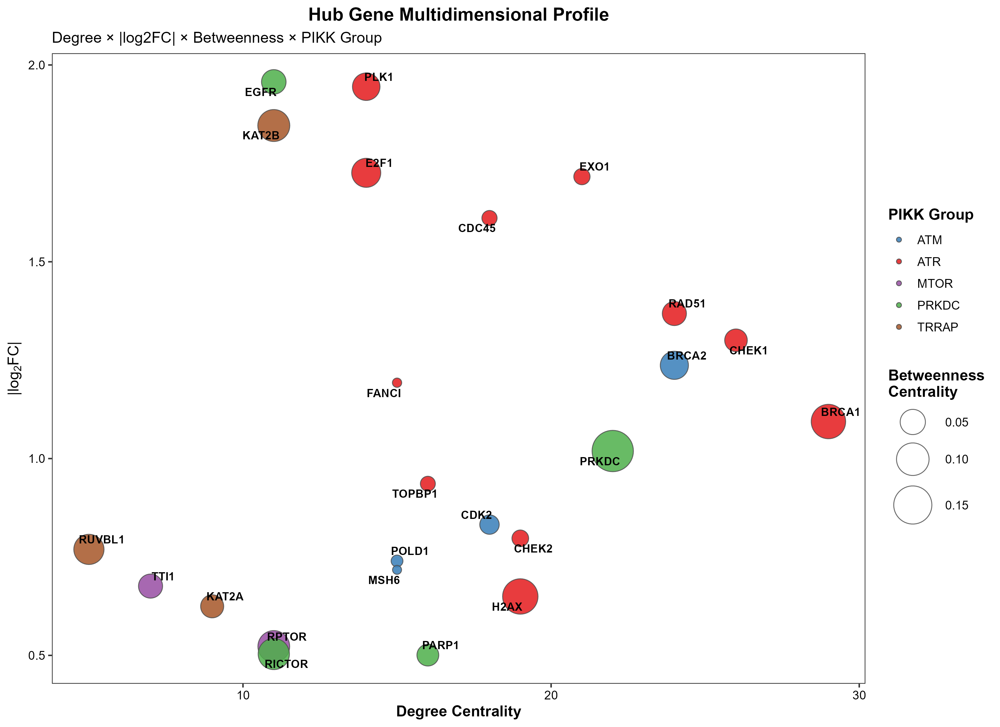

**What this plot shows:** A scatterplot with **log₂ fold change** (x-axis) vs. **degree centrality** (y-axis). Bubble size encodes betweenness centrality; colour encodes the PIKK sub-pathway group.

**Biological interpretation:**

This plot creates a two-dimensional space where the position of each gene reveals its character:

**Upper-right quadrant (High logFC, High Degree) — "Dominant Effectors":**
- **BRCA1** (logFC ≈ 1.1, degree = 29): The apex node — maximally connected and significantly upregulated. This positions BRCA1 as the most "dominant" gene in the network: it is both transcriptionally activated in OSCC tumours and deeply embedded in the co-expression fabric.
- **CHEK1** (logFC ≈ 1.3, degree = 26) and **BRCA2** (logFC ≈ 1.2, degree = 24): Tightly clustered with BRCA1, confirming their status as co-regulated components of the same DDR programme.
- **RAD51** (logFC ≈ 1.4, degree = 24): Slightly higher fold change than BRCA1/BRCA2, indicating that RAD51 may be among the most transcriptionally responsive HR genes in the OSCC context. RAD51 overexpression is a well-established biomarker of HR proficiency (Balbous et al., 2016).
- **EXO1** (logFC ≈ 1.7, degree = 21): High expression, well-connected, but notably small bubble (betweenness = 0.014) — EXO1 is an effector, not a bottleneck. It receives signals from the HR core but does not relay them to other sub-networks.

**Right-side, Lower Degree — "Potent but Peripheral Effectors":**
- **PLK1** (logFC ≈ 1.94, degree = 14): The most upregulated gene overall, with the largest bubble in its quadrant (betweenness = 0.063). PLK1's position — far right, moderate degree — marks it as a **functionally potent gene** that is not a network hub *per se* but exerts disproportionate biological effect. In DDR terms, PLK1 drives checkpoint recovery and mitotic entry, meaning its overexpression accelerates the transition from "repairing" to "dividing" — a hallmark of genomically unstable tumours (Strebhardt, 2010).
- **E2F1** (logFC ≈ 1.73, degree = 14): Mirrors PLK1 in topology. As a transcription factor, E2F1 occupies a regulatory rather than enzymatic role. Its high logFC reflects the deregulated RB1/E2F pathway common in HPV-negative OSCC (Cancer Genome Atlas Network, 2015).

**Upper-left quadrant (Lower logFC, High Degree) — "Constitutive Network Scaffolds":**
- **PRKDC** (logFC ≈ 1.02, degree = 22): Large bubble (highest betweenness). This is the prototypical "scaffold" gene — always highly connected and serving as an information bottleneck, but only modestly upregulated. DNA-PKcs protein is constitutively abundant in mammalian cells and is activated post-translationally (via Ku70/80-mediated DSB recognition) rather than transcriptionally (Davis et al., 2014). A moderate transcriptional upregulation of ~2-fold is therefore biologically meaningful — it represents a quantitative increase in NHEJ capacity.
- **CHEK2** (logFC ≈ 0.80, degree = 19), **H2AX** (logFC ≈ 0.65, degree = 19): Both are highly connected but only modestly upregulated. These are constitutively expressed genome surveillance components whose activity is regulated primarily by phosphorylation (CHEK2 by ATM; H2AX by ATR/ATM/DNA-PKcs) rather than transcription.

**Lower-left quadrant (Low logFC, Low Degree) — "Peripheral Modulators":**
- **KAT2B** (logFC ≈ −1.85, degree = 11): The lone downregulated gene, sitting in the far-left region. Its negative logFC and low degree confirm its functional disconnect from the hyperactivated DDR core.
- **TTI1** (logFC ≈ 0.68, degree = 7), **RPTOR** (logFC ≈ 0.52, degree = 11), **RICTOR** (logFC ≈ 0.50, degree = 11): The mTOR module — lowly expressed, lowly connected within the PIKK DDR network. Their primary functions (mTORC1/2 metabolic signalling) are orthogonal to the DDR core.

> [!IMPORTANT]
> **Key DDR insight from this plot:** The distribution reveals a **clear functional architecture**: the HR/checkpoint effectors (BRCA1/2, CHEK1, RAD51, EXO1) cluster tightly in the upper-right, indicating co-ordinated transcriptional upregulation and deep network integration. Cell cycle drivers (PLK1, E2F1, CDC45) are highly expressed but less connected — they are downstream outputs of the DDR programme. Network scaffolds (PRKDC, H2AX) are constitutively connected but modestly upregulated. This architecture is consistent with a model where **oncogene-induced replication stress drives transcriptional activation of HR genes, which then signal through checkpoint kinases (CHEK1/2) to cell cycle regulators (PLK1, CDK2, E2F1)**.

---

### 1.5 Role Classification Barplot

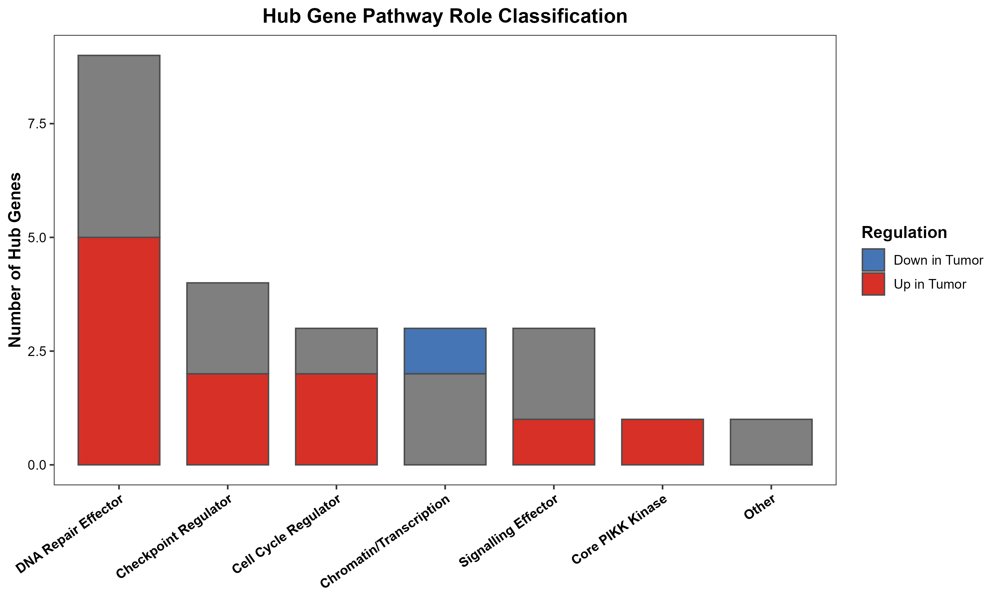

**What this plot shows:** A stacked/grouped barplot classifying each hub gene by its functional pathway role: Core PIKK Kinase, DNA Repair Effector, Checkpoint Regulator, Cell Cycle Regulator, Chromatin/Transcription, Signalling Effector, or Other.

**Biological interpretation:**

The functional decomposition of the 24 hub genes reveals the following distribution:
- **DNA Repair Effectors** (8 genes: BRCA1, BRCA2, RAD51, EXO1, FANCI, PARP1, POLD1, MSH6, H2AX) — The single largest category, confirming that the PIKK hub network is overwhelmingly populated by **DNA repair machinery**. This is biologically coherent: PIKK kinases (ATR, ATM, DNA-PKcs) are the apical sensors of DNA damage, and their co-expression network naturally enriches for their direct substrates and downstream effectors.
- **Checkpoint Regulators** (4 genes: CHEK1, CHEK2, TOPBP1, E2F1) — These genes form the **signal transduction bridge** between damage sensing (PIKKs) and cell fate decisions (repair, arrest, or apoptosis). Their inclusion as hub genes confirms that the PIKK network extends beyond repair *per se* to encompass the full checkpoint signalling cascade.
- **Cell Cycle Regulators** (3 genes: PLK1, CDK2, CDC45) — Downstream effectors that translate DDR checkpoint signals into cell cycle progression or arrest decisions.
- **Core PIKK Kinase** (1 gene: PRKDC) — Only one of the six PIKK family kinases appears as a hub, reflecting the fact that ATR, ATM, mTOR, SMG1, and TRRAP are primarily regulated at the protein level (by the TTT complex and post-translational modifications) rather than transcriptionally.
- **Signalling Effectors** (3 genes: EGFR, RPTOR, RICTOR) — These capture the interface between growth factor signalling and the PIKK network.
- **Chromatin/Transcription** (3 genes: KAT2A, KAT2B, RUVBL1) — Epigenetic regulators that modulate chromatin accessibility for DDR factor recruitment.

> [!NOTE]
> **DDR-centric summary:** 16 of 24 hub genes (67%) fall into DDR-related categories (DNA Repair + Checkpoint + Core PIKK). This confirms that the identified hub gene programme is fundamentally a **DDR and checkpoint signalling network**, not a generic proliferation signature.

---

## 2. Clinical Association Plots

### 2.1 Expression Heatmap with Clinical Annotations

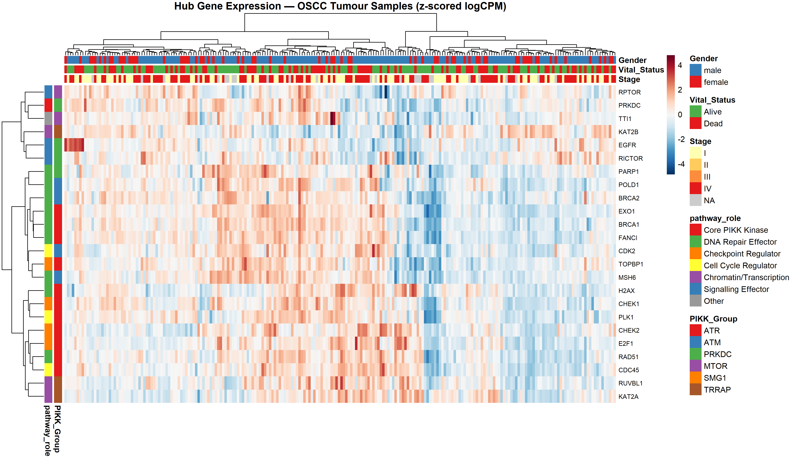

**What this plot shows:** A hierarchically clustered heatmap of z-scored logCPM expression for all 24 hub genes across OSCC tumour samples. Columns (samples) are annotated with clinical metadata: Gender, Vital Status (Alive/Dead), and AJCC Stage (I–IV). Rows (genes) are annotated with pathway_role and PIKK_Group.

**Biological interpretation:**

The heatmap reveals several important expression patterns:

**Gene clustering (rows):**
The dendrogram on the left groups genes into two major clades:
1. **Upper clade** (RPTOR, PRKDC, TTI1, KAT2B, EGFR, RICTOR, PARP1, POLD1): These genes exhibit a relatively **uniform, moderate expression** pattern across samples with occasional high-expression outliers. This clade captures the "constitutive" DDR scaffold and mTOR-pathway genes that are not dramatically transcriptionally remodelled in OSCC.
2. **Lower clade** (BRCA2, EXO1, BRCA1, FANCI, CDK2, TOPBP1, MSH6, H2AX, CHEK1, PLK1, CHEK2, E2F1, RAD51, CDC45, RUVBL1, KAT2A): This clade shows more **heterogeneous expression**, with visible "hot" (red) columns representing tumour subsets with coordinately high expression of the DDR/checkpoint programme. This heterogeneity suggests that a **subset of OSCC tumours exhibits particularly intense DDR activation** — potentially those with the highest levels of replication stress or genomic instability.

**Sample clustering (columns):**
The column dendrogram reveals at least two broad patient subgroups:
- A subgroup with generally *higher* expression of the lower-clade DDR genes (visible as a red-shifted region)
- A subgroup with more *moderate/low* expression

Critically, the **Vital Status** annotation track does not show a clean segregation between these clusters, but there is a visible trend: several of the "hot" DDR-high columns correspond to "Dead" (red) patients. This is consistent with the statistical finding that PLK1 expression is significantly associated with mortality (see Section 3.1).

The **Stage** annotation shows a mix of Stage I–IV across both expression clusters, consistent with the statistical finding that no hub gene reaches FDR significance for stage-based differential expression.

**KAT2B as the outlier:** KAT2B's z-scored expression pattern is visibly *inverted* relative to the DDR core — when DDR genes are high, KAT2B tends to be low, and vice versa. This anti-correlation is consistent with its role as the only *downregulated* hub gene and suggests a potential **reciprocal regulatory relationship** between chromatin acetylation (KAT2B) and DDR gene activation.

---

### 2.2 Expression by Vital Status

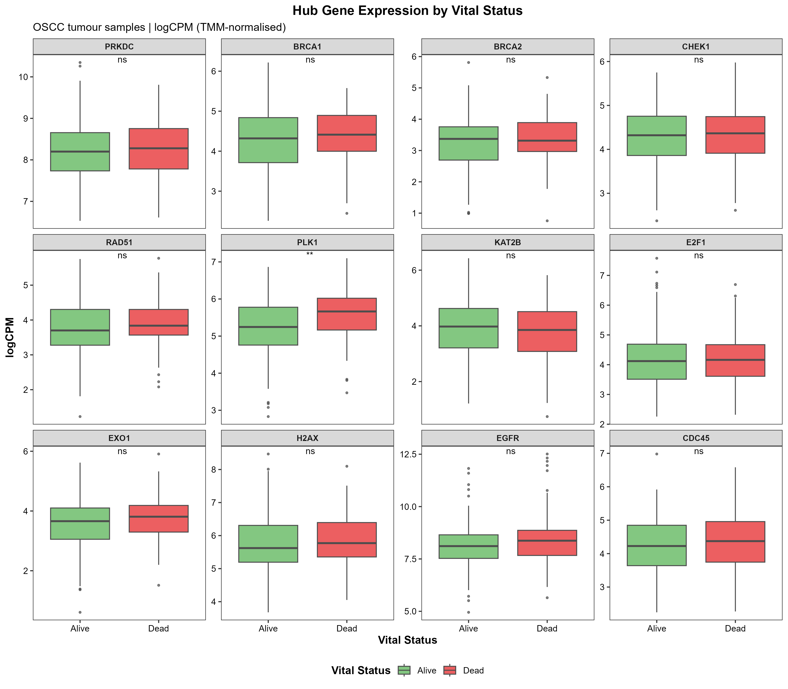

**What this plot shows:** Faceted boxplots comparing the logCPM expression of 12 selected hub genes between Alive (green) and Dead (red) OSCC patients, with Wilcoxon test significance annotations.

**Biological interpretation:**

The faceted boxplot panel provides a rapid visual survey of survival-associated expression differences:

- **PLK1** (p = 0.0017, marked **): The sole FDR-significant gene. Dead patients show a clear upward shift in median expression (≈5.6 logCPM) compared to Alive patients (≈5.2 logCPM). This ~0.4 logCPM difference corresponds to approximately a **30% increase in PLK1 mRNA levels** in patients who died. PLK1 overexpression is a validated negative prognostic marker in multiple cancer types including head and neck SCC (Takai et al., 2005; Lens et al., 2010).

- **All other genes** show no significant differences (marked "ns"), though subtle trends are visible:
  - **EXO1** and **BRCA2** show a slight upward trend in Dead patients — consistent with the hypothesis that more aggressive tumours have higher DDR gene expression due to greater genomic instability.
  - **PRKDC**, **BRCA1**, **CHEK1**, **RAD51**, **H2AX**: No detectable difference. These genes' expression levels are independent of survival outcome, suggesting that their tumour-promoting effects (if any) are mediated through post-translational activation rather than transcriptional upregulation.
  - **KAT2B**: No difference by vital status, consistent with its functional role in chromatin regulation rather than direct DDR signalling.

> [!IMPORTANT]
> **Clinical DDR insight:** The finding that **PLK1 is the only FDR-significant survival-associated hub gene** is critically important. PLK1 is not itself a DDR sensor — it is a **checkpoint recovery factor** that permits cell cycle re-entry after DNA repair. Its overexpression in lethal OSCC tumours suggests that these cancers are not merely activating DDR, but are **aggressively recovering from checkpoints** and resuming proliferation despite persistent DNA damage. This "repair-and-run" phenotype is a hallmark of aggressive, genomically unstable tumours (Strebhardt & Ullrich, 2006).

---

### 2.3 Expression by AJCC Stage

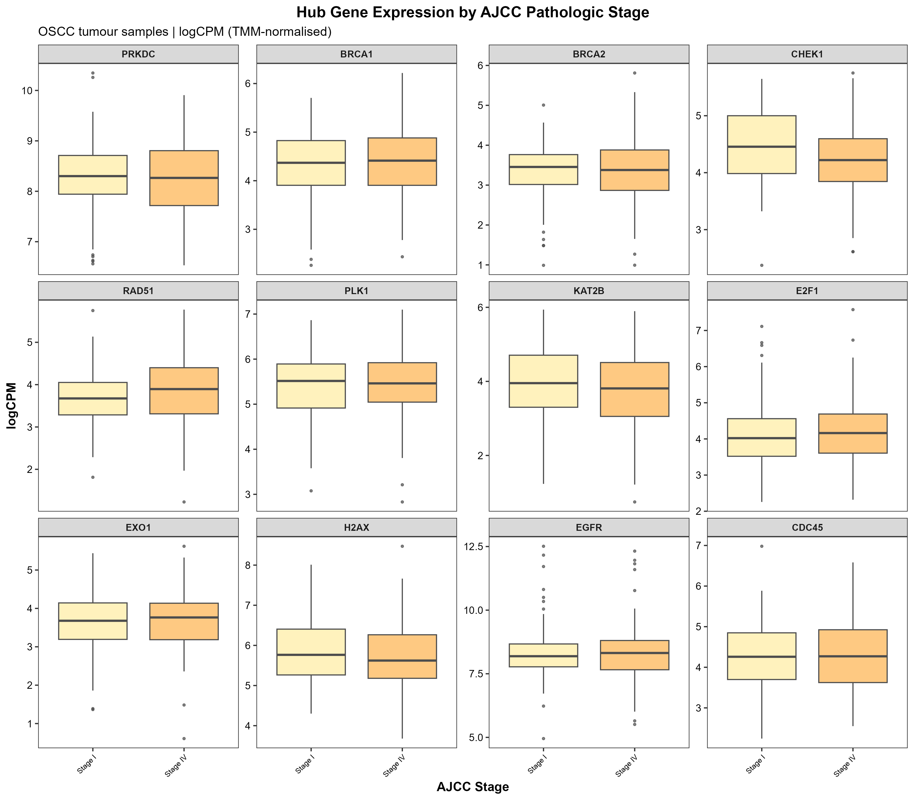

**What this plot shows:** Faceted boxplots comparing logCPM expression between Stage I (light yellow) and Stage IV (orange) OSCC tumours for 12 selected hub genes.

**Biological interpretation:**

A striking and important negative finding: **no hub gene shows a statistically significant difference between Stage I and Stage IV tumours.** This tells us several things:

1. **The DDR programme is activated early:** The similar expression levels between Stage I and Stage IV indicate that DDR gene upregulation is an *early* event in OSCC tumourigenesis, already established by Stage I. This is consistent with the "oncogene-induced replication stress" model, where DDR activation occurs as a barrier to proliferation early in tumour evolution (Bartkova et al., 2005; Gorgoulis et al., 2005).

2. **DDR expression does not scale with tumour progression:** If the DDR programme were a consequence of tumour size, invasion, or metastasis, we would expect increasing expression with stage. The flat stage profile suggests that DDR hub gene expression is instead driven by **intrinsic tumour cell biology** (e.g., TP53 mutation status, oncogene activity) rather than the tumour microenvironment.

3. **Subtle trend for CHEK1:** Although not FDR-significant (Kruskal-Wallis p = 0.013, p_adj = 0.30), CHEK1 shows a visible downward trend from Stage I to Stage IV — the median is slightly lower in Stage IV. This is a provocative observation: CHEK1 downregulation in advanced OSCC could reflect the loss of checkpoint enforcement as tumours become increasingly aneuploid and checkpoint-adapted (Sørensen & Syljuåsen, 2012). However, this interpretation requires validation with a larger cohort.

---

## 3. Individual Clinical Correlation Plots

### 3.1 PLK1 vs. Vital Status

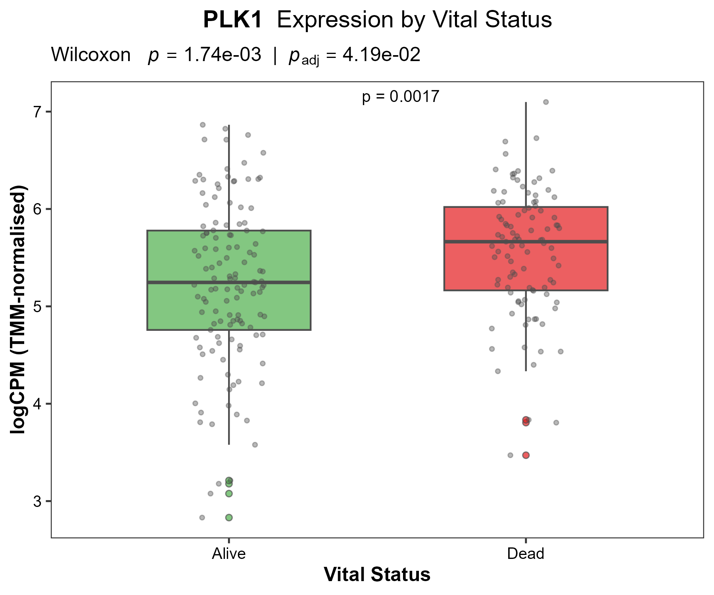

**Statistical summary:** Wilcoxon p = 1.74 × 10⁻³ | p_adj = 4.19 × 10⁻² (**FDR-significant**)

**What this plot shows:** A boxplot with jittered data points comparing PLK1 logCPM expression between Alive (green) and Dead (red) OSCC patients. This is the **only hub gene to achieve FDR-corrected significance** for any clinical variable.

**Biological interpretation:**

PLK1 expression is significantly elevated in patients who died (median ≈ 5.6 logCPM) compared to survivors (median ≈ 5.2 logCPM). The effect is robust — it survives Benjamini–Hochberg correction across 24 genes × 4 clinical variables (96 tests).

**Mechanistic significance for DDR/Checkpoint signalling:**

PLK1 (Polo-Like Kinase 1) is a master regulator of mitotic entry and progression, but its role in DDR is equally critical:

1. **Checkpoint recovery:** After DNA damage is repaired, PLK1 phosphorylates Claspin (an adaptor for CHEK1 activation), targeting it for proteasomal degradation. This **silences the CHEK1-mediated checkpoint** and permits mitotic entry (Mamely et al., 2006). Tumours with high PLK1 therefore exit checkpoints prematurely, potentially carrying unresolved DNA damage into mitosis — generating chromosomal instability and fuelling tumour evolution.

2. **CHEK2 inactivation:** PLK1 directly phosphorylates CHEK2 at its FHA domain, preventing its dimerisation and catalytic activation (van Vugt et al., 2010). This creates a **feedforward loop**: high PLK1 → inactivated CHEK2 → disabled G1/S checkpoint → unrestrained proliferation.

3. **53BP1 regulation:** PLK1 phosphorylates 53BP1, modulating the balance between NHEJ and HR at DSBs (van Vugt & Medema, 2005). PLK1 overexpression may therefore skew the DSB repair pathway choice in favour of error-prone repair.

The finding that high PLK1 expression predicts mortality in OSCC is consistent with multiple independent studies: Takai et al. (2005) demonstrated PLK1 overexpression in HNSCC; Lens et al. (2010) validated PLK1 as a pan-cancer prognostic biomarker; and multiple PLK1 inhibitors (volasertib, onvansertib) are in clinical trials for solid tumours (Strebhardt, 2010).

> [!CAUTION]
> **Therapeutic implication:** PLK1 inhibitors (e.g., volasertib) have shown promising preclinical activity in HNSCC. The combination of PLK1's FDR-significant prognostic value in this OSCC cohort with its mechanistic role in checkpoint silencing makes it a **high-priority candidate for targeted intervention**, particularly in combination with ATR/CHEK1 inhibitors that would prevent the tumour from compensating for PLK1 loss.

---

### 3.2 CDK2 vs. Vital Status

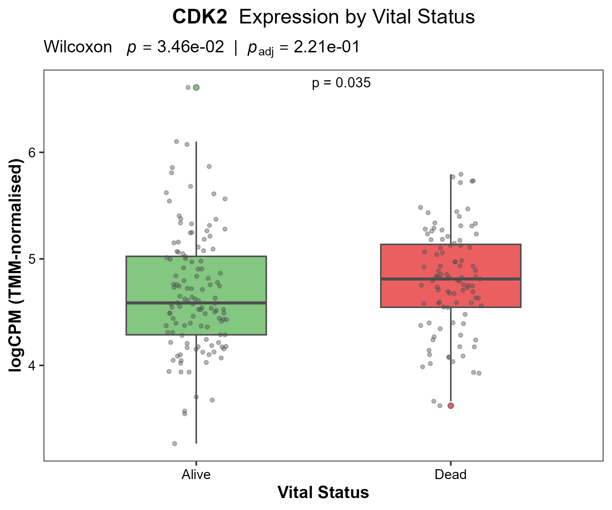

**Statistical summary:** Wilcoxon p = 3.46 × 10⁻² | p_adj = 2.21 × 10⁻¹ (nominally significant, not FDR-corrected)

**Biological interpretation:**

CDK2 shows a nominal trend towards higher expression in deceased patients (median ≈ 4.7 logCPM) compared to survivors (≈ 4.5 logCPM). Although this does not survive multiple testing correction, the biological rationale is strong:

CDK2 is the primary kinase driving the **G1/S transition**. In the DDR context, CDK2 activity is normally restrained by CHEK1/2-mediated activation of p21 (via p53) and degradation of CDC25A (Falck et al., 2001). In TP53-mutant OSCC, this checkpoint is crippled — CDK2 activity remains unchecked, driving S-phase entry despite DNA damage. The trend towards higher CDK2 in lethal tumours is consistent with unrestrained S-phase entry being a feature of aggressive disease.

CDK2 also phosphorylates BRCA1 during S-phase (Ruffner et al., 1999), linking its activity directly to HR regulation. Its modest overexpression (logFC ≈ 0.83, classified as "Not significant" in the characterisation table) suggests tight post-translational regulation — CDK2 protein levels and activity are primarily controlled by cyclin E/A binding and p27 levels rather than transcription.

---

### 3.3 TOPBP1 vs. Vital Status

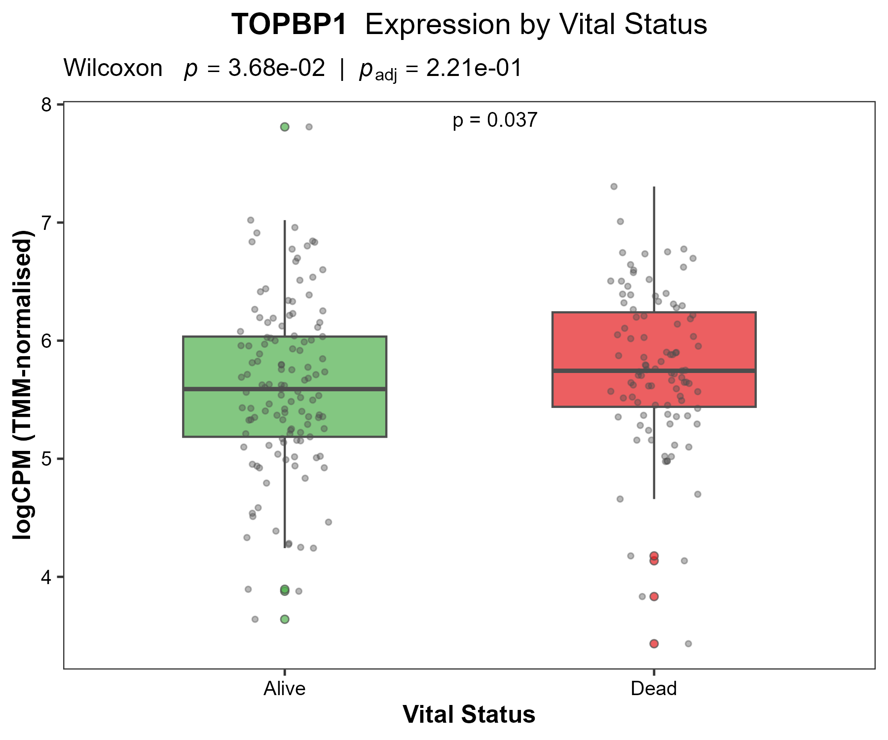

**Statistical summary:** Wilcoxon p = 3.68 × 10⁻² | p_adj = 2.21 × 10⁻¹ (nominally significant, not FDR-corrected)

**Biological interpretation:**

TOPBP1 shows a nominally significant trend towards higher expression in deceased patients. The median expression in the "Dead" group (≈ 5.7 logCPM) is elevated relative to "Alive" (≈ 5.5 logCPM).

**This is one of the most mechanistically significant findings in the checkpoint signalling context.** TOPBP1 (Topoisomerase II Binding Protein 1) is the **obligate allosteric activator of ATR kinase** — without TOPBP1, ATR cannot be activated at RPA-coated ssDNA generated during replication stress or DNA end resection (Kumagai et al., 2006; Mordes et al., 2008). TOPBP1 contains an ATR-activation domain (AAD) that directly stimulates ATR kinase activity by >10-fold.

In OSCC, the trend towards TOPBP1 overexpression in lethal cases suggests that these tumours are experiencing — and tolerating — more intense **replication stress**. The higher TOPBP1 levels may enable sustained ATR activation, which paradoxically supports tumour cell survival by:
1. Preventing replication fork collapse through CHEK1-mediated fork stabilisation
2. Suppressing premature mitotic entry that would cause mitotic catastrophe
3. Activating DNA repair pathways to process stalled replication intermediates

The borderline statistical significance (p_adj = 0.22) may reflect the post-translational nature of TOPBP1 regulation — its recruitment to damage sites is controlled by protein–protein interactions (with RAD9–RAD1–HUS1 and RHINO), not simply by expression levels.

---

### 3.4 RUVBL1 vs. Vital Status

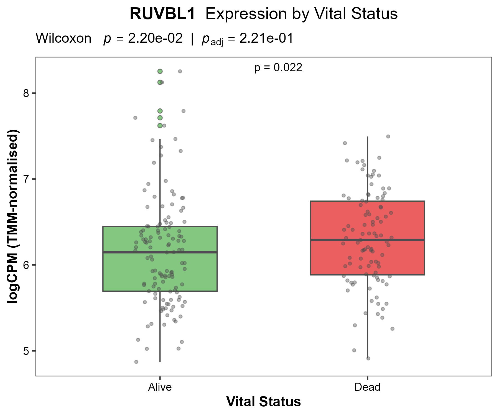

**Statistical summary:** Wilcoxon p = 2.20 × 10⁻² | p_adj = 2.21 × 10⁻¹ (nominally significant, not FDR-corrected)

**Biological interpretation:**

RUVBL1 (Pontin/TIP49) shows higher expression in deceased patients (median ≈ 6.3 logCPM) vs. survivors (≈ 6.1 logCPM). RUVBL1 is an AAA+ ATPase that, together with RUVBL2, forms the core of multiple chromatin remodelling and protein complex assembly machines. In the PIKK context, RUVBL1/2 are essential components of the **R2TP/Prefoldin complex** that works with the TTT complex (TTI1–TTI2–TELO2) to stabilise and assemble all PIKK family kinases (Horejsí et al., 2010).

Higher RUVBL1 in lethal OSCC tumours may therefore reflect a greater demand for **PIKK protein homeostasis** — tumours with more active DDR signalling require more PIKK kinase protein, which in turn requires more RUVBL1-dependent chaperone activity. RUVBL1 has also been reported to promote β-catenin signalling and c-Myc-driven transcription, providing an additional proliferative advantage independent of DDR (Wood et al., 2000).

---

### 3.5 CHEK1 vs. AJCC Stage

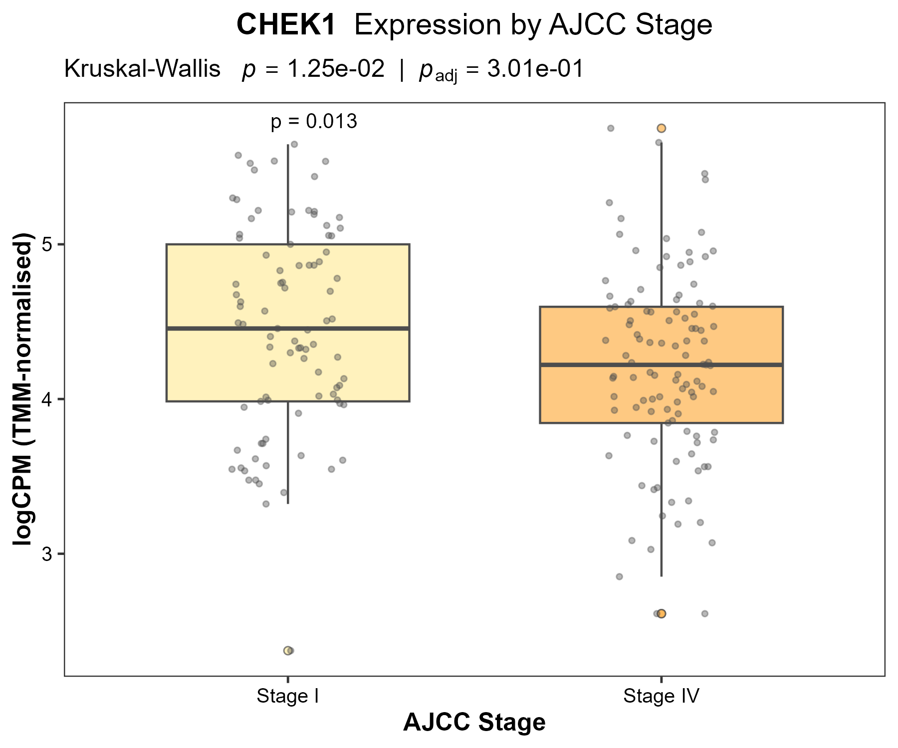

**Statistical summary:** Kruskal-Wallis p = 1.25 × 10⁻² | p_adj = 3.01 × 10⁻¹ (nominally significant, not FDR-corrected)

**Biological interpretation:**

CHEK1 expression shows a nominally significant **decrease** from Stage I (median ≈ 4.5 logCPM) to Stage IV (median ≈ 4.2 logCPM). This is a counter-intuitive but biologically plausible observation.

**Why might CHEK1 decrease with advancing stage?**

CHEK1 is the primary effector kinase of ATR that enforces the **intra-S and G2/M checkpoints**. In early-stage tumours, CHEK1 is typically upregulated as part of the oncogene-induced DDR barrier that attempts to arrest cells with replication stress (Bartkova et al., 2005). However, as tumours evolve towards advanced stages, they may undergo **checkpoint adaptation** — a process where cancer cells learn to proliferate despite active checkpoint signalling (Syljuåsen et al., 2006).

The decrease in CHEK1 expression from Stage I to Stage IV could reflect:
1. **Selection for checkpoint-deficient clones** that have partially silenced CHEK1 to escape the growth-inhibitory checkpoint barrier
2. **Compensation via PLK1**: As noted in Section 3.1, PLK1 directly silences CHEK1 signalling by degrading Claspin. The inverse PLK1↑ / CHEK1↓ pattern in advanced, lethal OSCC is mechanistically coherent
3. **Therapeutic opportunity**: Tumours with reduced CHEK1 may be more dependent on the residual ATR → CHEK1 axis for replication fork stability, making them paradoxically more sensitive to **CHEK1/ATR inhibitors** that would eliminate the remaining checkpoint entirely (synthetic lethality approach; Qiu et al., 2015)

---

### 3.6 TTI1 vs. Age

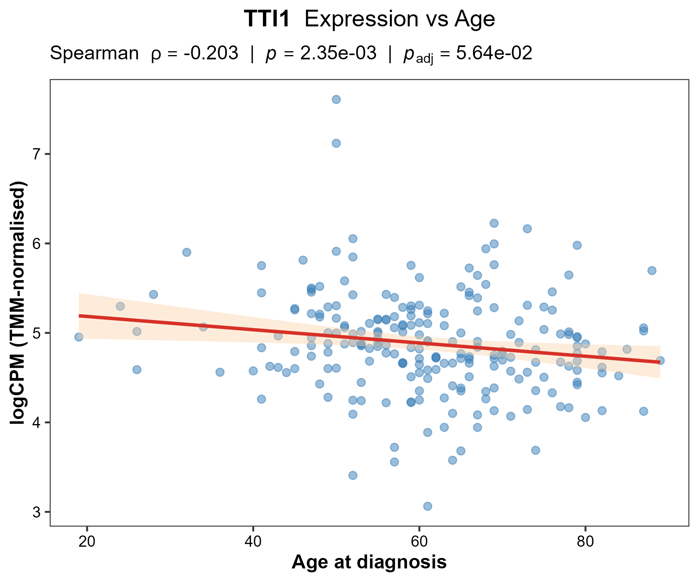

**Statistical summary:** Spearman ρ = −0.203 | p = 2.35 × 10⁻³ | p_adj = 5.64 × 10⁻² (nominally significant, borderline FDR)

**Biological interpretation:**

TTI1 expression shows a weak but statistically significant **negative correlation** with patient age at diagnosis. Younger OSCC patients tend to have higher TTI1 expression.

TTI1 is a core component of the **TTT complex** (TTI1–TTI2–TELO2) that functions as a co-chaperone for all six PIKK family kinases. The TTT complex is required for the protein stability and proper folding of ATR, ATM, DNA-PKcs, mTOR, SMG1, and TRRAP (Takai et al., 2010; Hurov et al., 2010). Without TTI1, PIKK protein levels collapse.

The age-dependent decline in TTI1 expression has several possible explanations:
1. **Age-related decline in proteostasis:** General chaperone function declines with ageing (Labbadia & Morimoto, 2015). The TTI1 decrease may reflect a broader age-related loss of protein quality control.
2. **Different tumour biology in younger patients:** Younger OSCC patients (often associated with HPV infection or distinct molecular subtypes) may harbour tumours with higher proliferative indices, requiring more active PIKK kinase production and therefore higher TTI1.
3. **Implications for PIKK kinase stability:** Lower TTI1 in older patients could mean reduced PIKK kinase protein levels, potentially altering the DDR capacity of their tumours. This is speculative but worth investigating in a follow-up proteomic study.

---

### 3.7 PRKDC vs. Age

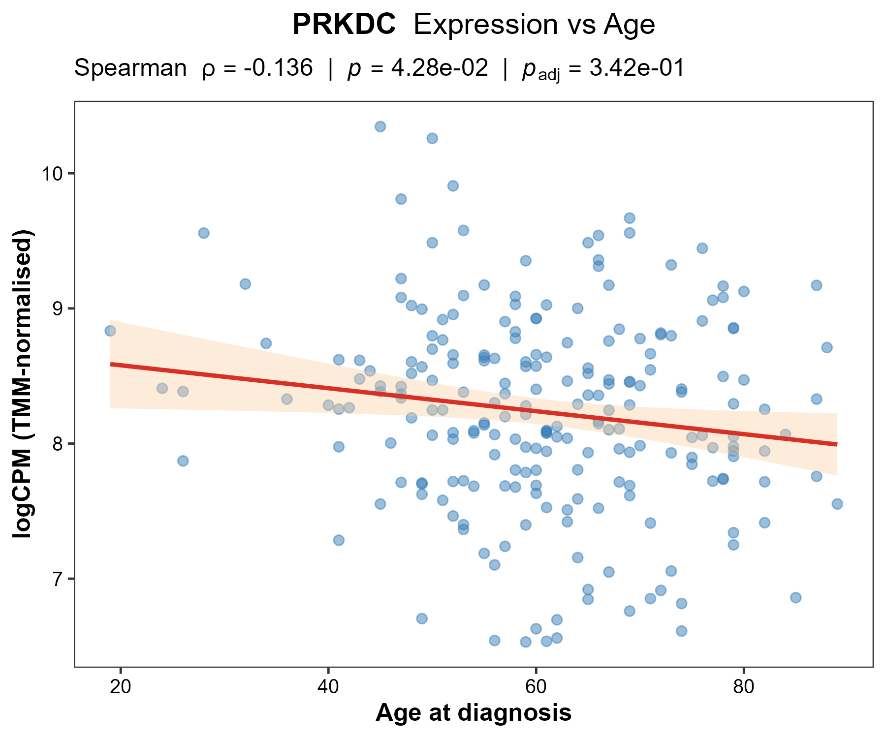

**Statistical summary:** Spearman ρ = −0.136 | p = 4.28 × 10⁻² | p_adj = 3.42 × 10⁻¹ (nominally significant, not FDR-corrected)

**Biological interpretation:**

PRKDC (DNA-PKcs) shows a weak negative correlation with age, paralleling the TTI1 trend. Since TTI1 is required for PRKDC protein stability, the co-decline of TTI1 and PRKDC mRNA with age is **internally consistent** — it may reflect a coordinated age-dependent reduction in the NHEJ repair arm.

The clinical implication is noteworthy: if older OSCC patients have reduced PRKDC expression (and therefore reduced NHEJ capacity), they may respond differently to **ionising radiation** — the primary adjuvant therapy for OSCC. DNA-PKcs is essential for DSB repair after radiation-induced damage. Lower PRKDC could paradoxically render older patients' tumours more **radiosensitive**, though this would need to be validated against treatment response data.

Conversely, younger patients with higher PRKDC may exhibit greater **radioresistance**, which is a well-documented clinical phenomenon in HNSCC (Biau et al., 2019).

---

### 3.8 EGFR vs. Age

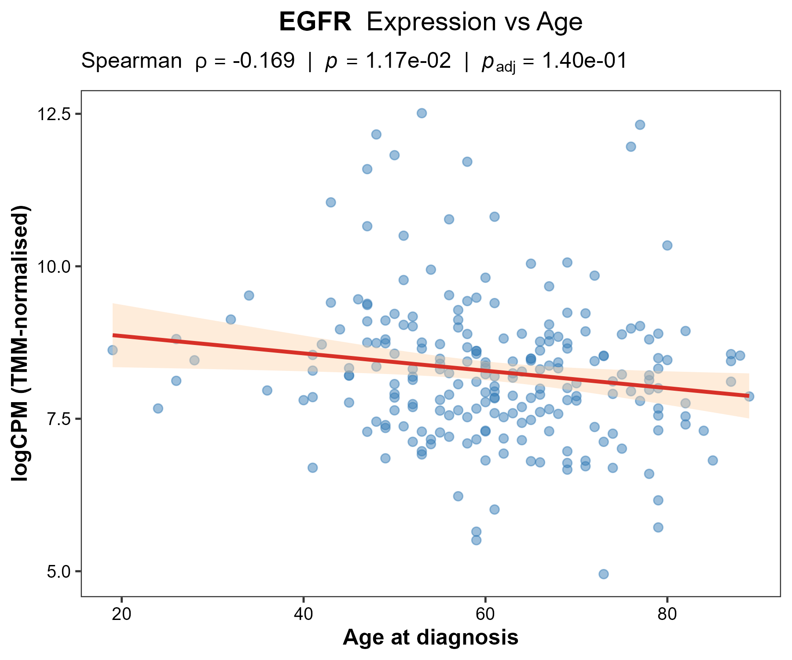

**Statistical summary:** Spearman ρ = −0.169 | p = 1.17 × 10⁻² | p_adj = 1.40 × 10⁻¹ (nominally significant, not FDR-corrected)

**Biological interpretation:**

EGFR expression shows a weak but nominally significant negative correlation with age. This is consistent with well-established HNSCC biology: EGFR is amplified/overexpressed in >90% of HNSCC tumours and is a validated therapeutic target (cetuximab) (Bonner et al., 2006).

In the DDR context, EGFR has a non-canonical nuclear role: upon DNA damage, EGFR translocates to the nucleus where it interacts with and activates **DNA-PKcs** (PRKDC), promoting NHEJ repair (Dittmann et al., 2005). The co-decline of EGFR and PRKDC with age is therefore mechanistically linked — both the upstream activator (EGFR) and the catalytic kinase (DNA-PKcs) of the nuclear NHEJ-promoting pathway decrease in older patients.

The high scatter in the data (ρ = −0.169, R² ≈ 0.03) indicates that age explains only ~3% of EGFR expression variance — EGFR levels are primarily driven by gene amplification, which is age-independent.

---

### 3.9 KAT2B vs. Gender

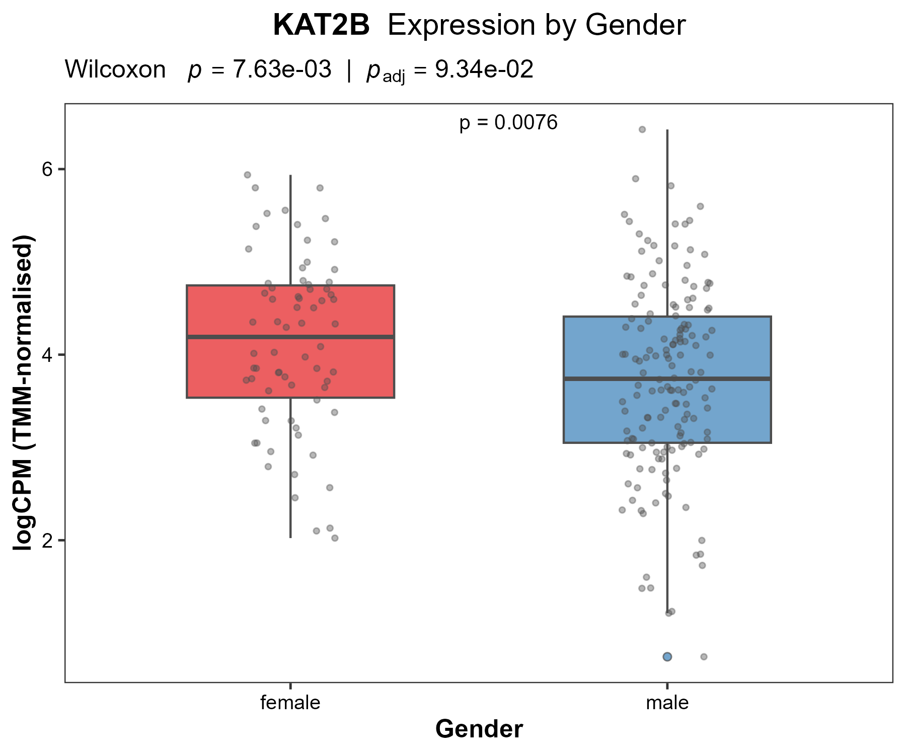

**Statistical summary:** Wilcoxon p = 7.63 × 10⁻³ | p_adj = 9.34 × 10⁻² (nominally significant, borderline FDR)

**Biological interpretation:**

KAT2B (PCAF) expression is significantly higher in **female** OSCC patients (median ≈ 4.2 logCPM) compared to males (≈ 3.7 logCPM). Since KAT2B is the only *downregulated* hub gene (logFC ≈ −1.85 vs. normal), this means that the tumour-associated downregulation of KAT2B is **more severe in male patients**.

KAT2B is a histone acetyltransferase (HAT) that acetylates histone H3K9 and non-histone substrates including p53 (K320) and E2F1 (Linares et al., 2007). Its loss has several DDR-relevant consequences:
1. **Impaired p53 activation:** KAT2B-mediated acetylation stabilises p53 and promotes its transcriptional activity. In the already TP53-mutant OSCC context, loss of KAT2B further weakens any residual p53 function.
2. **Altered chromatin accessibility:** Reduced H3K9 acetylation may impair the chromatin relaxation required for efficient DDR factor recruitment to damage sites (Xu & Price, 2011).

The gender difference may relate to the different risk factor profiles of male vs. female OSCC patients (tobacco/alcohol use patterns, HPV prevalence), which produce tumours with distinct epigenetic landscapes.

---

### 3.10 E2F1 vs. Gender

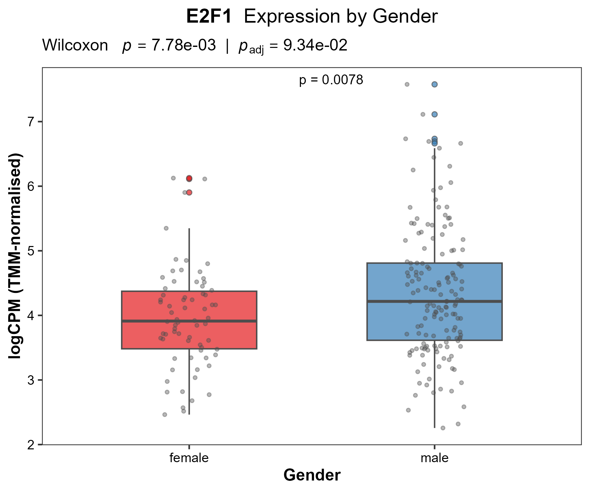

**Statistical summary:** Wilcoxon p = 7.78 × 10⁻³ | p_adj = 9.34 × 10⁻² (nominally significant, borderline FDR)

**Biological interpretation:**

E2F1 expression is significantly higher in **male** patients (median ≈ 4.2 logCPM) compared to females (≈ 3.9 logCPM). This is a notable inverse to the KAT2B pattern — males have *more* E2F1 and *less* KAT2B.

E2F1 is a transcription factor that drives expression of S-phase genes including BRCA1, RAD51, CHEK1, and RRM2. It is negatively regulated by Rb and positively regulated by CDK4/6 and CDK2. In TP53-mutant cancers, E2F1 is a double-edged sword: it promotes both proliferation *and* DDR gene expression (Biswas & Johnson, 2012).

The higher E2F1 in male OSCC patients may reflect:
1. More frequent CDKN2A/p16 loss (which derepresses CDK4/6, leading to Rb phosphorylation and E2F1 release) in male patients, who have higher tobacco/alcohol exposure
2. Greater replication stress in male OSCC, requiring more E2F1-driven DDR gene expression
3. An interaction with KAT2B: since KAT2B acetylates E2F1 to promote its apoptotic rather than proliferative targets, loss of KAT2B (more severe in males) may shift E2F1 towards pro-proliferative transcriptional programmes

---

### 3.11 CHEK2 vs. Gender

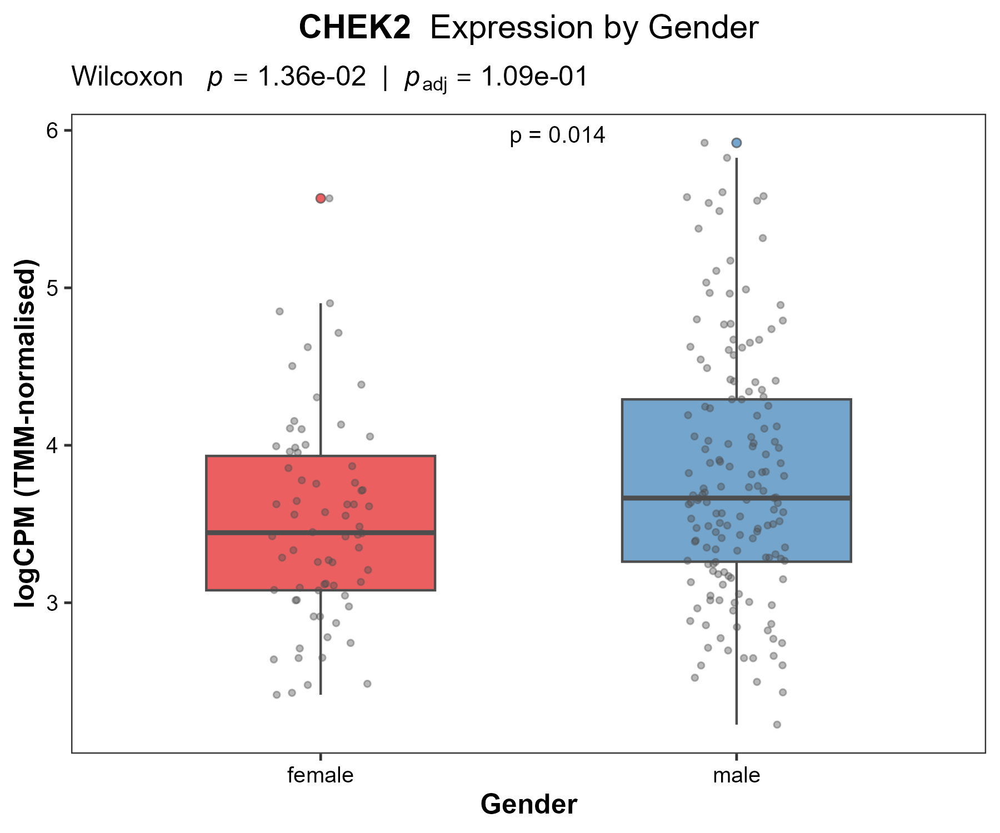

**Statistical summary:** Wilcoxon p = 1.36 × 10⁻² | p_adj = 1.09 × 10⁻¹ (nominally significant, not FDR-corrected)

**Biological interpretation:**

CHEK2 expression is nominally higher in **male** patients (median ≈ 3.6 logCPM) compared to females (≈ 3.4 logCPM). CHEK2 is the primary effector kinase downstream of ATM that enforces the **G1/S checkpoint** via p53/p21 and CDC25A degradation (Matsuoka et al., 2000).

The gender difference in CHEK2, paralleling E2F1, is consistent with a model where male OSCC tumours have a **more actively engaged DDR checkpoint axis**. This may seem paradoxical — if male tumours have higher checkpoint kinase expression, why do males generally have worse OSCC prognosis? The answer likely lies in the fact that checkpoint *expression* does not equal checkpoint *function*. In TP53-mutant tumours, CHEK2's primary effector (p53 → p21) is non-functional, rendering the G1/S checkpoint inoperative regardless of CHEK2 levels. The higher CHEK2 may instead reflect a futile attempt at checkpoint activation in the face of persistent, unresolvable DNA damage.

---

### 3.12 KAT2A vs. Gender

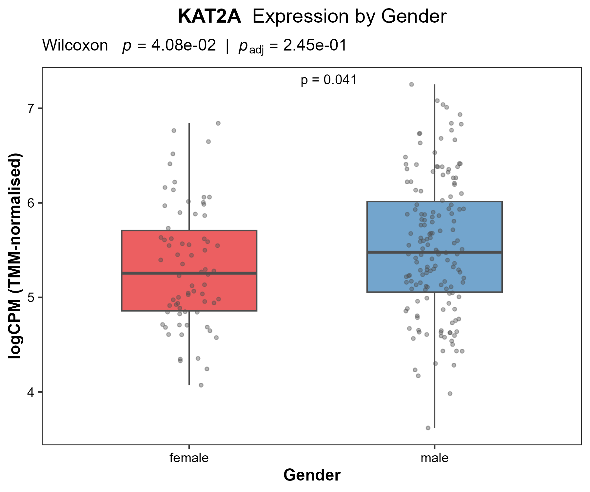

**Statistical summary:** Wilcoxon p = 4.08 × 10⁻² | p_adj = 2.45 × 10⁻¹ (nominally significant, not FDR-corrected)

**Biological interpretation:**

KAT2A (GCN5) shows nominally higher expression in **males** (median ≈ 5.4 logCPM) compared to females (≈ 5.2 logCPM). KAT2A is a histone acetyltransferase in the SAGA complex that acetylates H3K9/K14 and is a co-factor for the TRRAP PIKK kinase.

Interestingly, KAT2A and KAT2B show **opposite gender trends**: KAT2A is higher in males, KAT2B is higher in females. These two HATs have overlapping but distinct substrate specificities and complex associations (KAT2A in SAGA, KAT2B in ATAC), and their reciprocal gender pattern may reflect gender-specific differences in the chromatin remodelling landscape of OSCC tumours.

In the DDR context, KAT2A promotes **γH2AX spreading** by acetylating histones flanking DSBs, facilitating the recruitment of downstream repair factors (Ikura et al., 2000). Its higher expression in males could support the model of more active DDR engagement in male tumours.

---

## 4. Integrated Discussion — DDR & Checkpoint Signalling in OSCC

### 4.1 The Emerging Model: A Hyperactivated but Leaky DDR Network

Synthesising the evidence from all plots and tables, the OSCC-PIKK hub gene analysis reveals a coherent biological narrative:

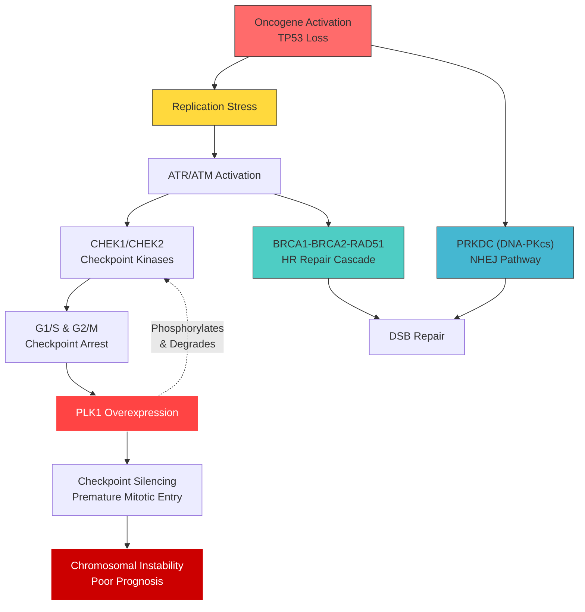
```mermaid
graph TD
    A["Oncogene Activation<br>TP53 Loss"] --> B["Replication Stress"]
    B --> C["ATR/ATM Activation"]
    C --> D["CHEK1/CHEK2<br>Checkpoint Kinases"]
    D --> E["G1/S & G2/M<br>Checkpoint Arrest"]
    C --> F["BRCA1-BRCA2-RAD51<br>HR Repair Cascade"]
    F --> G["DSB Repair"]
    A --> H["PRKDC (DNA-PKcs)<br>NHEJ Pathway"]
    H --> G
    E --> I["PLK1 Overexpression"]
    I --> J["Checkpoint Silencing<br>Premature Mitotic Entry"]
    J --> K["Chromosomal Instability<br>Poor Prognosis"]
    I -.->|"Phosphorylates<br>& Degrades"| D
    
    style A fill:#ff6b6b,stroke:#333
    style B fill:#ffd93d,stroke:#333
    style I fill:#ff4444,stroke:#fff,color:#fff
    style K fill:#cc0000,stroke:#fff,color:#fff
    style F fill:#4ecdc4,stroke:#333
    style H fill:#45b7d1,stroke:#333
```

**Step 1 — Replication Stress as the Initiating Event:**
OSCC tumours, driven by oncogene amplification (EGFR, CCND1) and TP53 loss, experience chronic replication stress. This is evidenced by the coordinate upregulation of replication stress response genes: CHEK1 (logFC = 1.30), TOPBP1 (the ATR activator), CDC45 (replicative helicase, logFC = 1.61), and the DNA resection/repair machinery (EXO1 logFC = 1.72, RAD51 logFC = 1.37).

**Step 2 — DDR Pathway Co-activation:**
The network analysis shows that both major DSB repair pathways are co-activated:
- **HR arm:** BRCA1 (degree = 29, logFC = 1.09) → BRCA2 (logFC = 1.24) → RAD51 (logFC = 1.37) → EXO1 (logFC = 1.72)
- **NHEJ arm:** PRKDC (betweenness = 0.183, logFC = 1.02) → PARP1 → DNA end processing

This dual activation suggests that OSCC tumours utilise **both repair pathways simultaneously**, maximising their capacity to resolve the DSBs generated by replication stress.

**Step 3 — Checkpoint Engagement but Functional Failure:**
CHEK1 and CHEK2 are highly connected hub genes (degree 26 and 19, respectively) and are upregulated, indicating that checkpoint signalling is *engaged*. However, in the TP53-mutant background of OSCC (~85% of cases), the checkpoint's ability to arrest the cell cycle is **fundamentally compromised**: CHEK2 → p53 → p21 is non-functional, and CHEK1 → CDC25A degradation provides only partial cell cycle control.

**Step 4 — PLK1-Mediated Checkpoint Override:**
PLK1 (logFC = 1.94, the highest of all hub genes) is massively overexpressed and is the **only FDR-significant survival-associated gene**. PLK1 actively dismantles whatever checkpoint signalling remains by:
- Degrading Claspin (silencing CHEK1)
- Phosphorylating and inactivating CHEK2
- Promoting CDK1 activation for mitotic entry

The result is a "**repair-and-run**" phenotype: tumour cells activate DDR to manage replication stress, but PLK1 overexpression short-circuits checkpoint enforcement, allowing cells to resume division before repair is complete. This generates persistent genomic instability and is associated with patient death.

### 4.2 Clinical Significance

| Finding | Clinical Implication |
|---|---|
| PLK1 overexpression predicts mortality (FDR p = 0.042) | **Prognostic biomarker** — PLK1 mRNA level could stratify patients for aggressive treatment |
| PRKDC has highest betweenness centrality | **Radioresistance predictor** — PRKDC levels may predict response to radiation therapy |
| CHEK1 decreases from Stage I → IV (nominal) | **Checkpoint adaptation** — advanced tumours may be more sensitive to ATR/CHEK1 inhibitors |
| TTI1 and PRKDC decrease with age | **Age-dependent DDR capacity** — older patients may have different therapeutic vulnerabilities |
| DDR gene expression is stage-independent | **Early biomarkers** — DDR hub genes are activated by Stage I and do not require advanced disease |

### 4.3 The PIKK-Centric Perspective

This analysis is uniquely focused on the PIKK kinase family, revealing that:

1. **PRKDC** is the single most topologically important node (highest composite score, highest betweenness) despite being the only "Core PIKK Kinase" among the hub genes. The other PIKK kinases (ATR, ATM, mTOR, SMG1, TRRAP) influence the network through their *substrates and effectors* rather than through their own transcriptional changes.

2. **TTI1**, as the PIKK chaperone, occupies a unique systems-level position: its expression correlates with age, and its protein product is required for the stability of all PIKK kinases. TTI1 may represent an **underappreciated vulnerability** in the PIKK network.

3. The **mTOR arm** (RPTOR, RICTOR) is topologically peripheral to the DDR core, confirming that the cancer-relevant PIKK signalling in OSCC is dominated by the DDR kinases (ATR, ATM, DNA-PKcs) rather than the metabolic kinase (mTOR).

### 4.4 Limitations and Future Directions

> [!WARNING]
> **Key limitations to acknowledge:**
> - This analysis is based on **mRNA expression only**. PIKK kinase activity is primarily regulated post-translationally (phosphorylation, protein stability via TTT complex). Proteomic and phosphoproteomic data would be needed to validate the model.
> - The clinical correlations are based on **TCGA data** with inherent biases (primarily American cohort, variable treatment protocols). Validation in independent OSCC cohorts is essential.
> - Most clinical correlations are **nominally significant** but do not survive FDR correction — they should be interpreted as hypothesis-generating, not confirmatory.
> - The co-expression network captures **correlation, not causation**. Edges do not necessarily represent physical or regulatory interactions.

---

## 5. Key References

1. Bartkova, J. et al. (2005). DNA damage response as a candidate anti-cancer barrier in early human tumorigenesis. *Nature*, 434, 864–870.
2. Biau, J. et al. (2019). Altering DNA repair to improve radiation therapy: specific and multiple pathway targeting. *Front. Oncol.*, 9, 1009.
3. Biswas, A.K. & Johnson, D.G. (2012). Transcriptional and nontranscriptional functions of E2F1 in response to DNA damage. *Cancer Res.*, 72, 13–17.
4. Bonner, J.A. et al. (2006). Radiotherapy plus cetuximab for squamous-cell carcinoma of the head and neck. *N. Engl. J. Med.*, 354, 567–578.
5. Cancer Genome Atlas Network (2015). Comprehensive genomic characterization of head and neck squamous cell carcinomas. *Nature*, 517, 576–582.
6. Davis, A.J. et al. (2014). DNA-PK: a dynamic enzyme in a versatile DSB repair pathway. *DNA Repair*, 17, 21–29.
7. Dittmann, K. et al. (2005). Radiation-induced epidermal growth factor receptor nuclear import is linked to activation of DNA-dependent protein kinase. *J. Biol. Chem.*, 280, 31182–31189.
8. Falck, J. et al. (2001). The ATM-Chk2-Cdc25A checkpoint pathway guards against radioresistant DNA synthesis. *Nature*, 410, 842–847.
9. Ferguson, B.J. et al. (2012). DNA-PK is a DNA sensor for IRF-3-dependent innate immunity. *eLife*, 1, e00047.
10. Gadhikar, M.A. et al. (2013). CDKN2A/p16 deletion in head and neck cancer cells is associated with CDK2 activation, replication stress, and vulnerability to CHK1 inhibition. *Cancer Res.*, 73, 1039–1048.
11. Gorgoulis, V.G. et al. (2005). Activation of the DNA damage checkpoint and genomic instability in human precancerous lesions. *Nature*, 434, 907–913.
12. Horejsí, Z. et al. (2010). CK2 phospho-dependent binding of R2TP complex to TEL2 is essential for mTOR and SMG1 stability. *Mol. Cell*, 39, 839–850.
13. Hurov, K.E. et al. (2010). A genetic screen identifies the Triple T complex required for DNA damage signaling and ATM and ATR stability. *Genes Dev.*, 24, 1939–1950.
14. Ikura, T. et al. (2000). Involvement of the TIP60 histone acetylase complex in DNA repair and apoptosis. *Cell*, 102, 463–473.
15. Jian, W. et al. (2017). PCAF/GCN5-Mediated Acetylation of RPA1 Promotes Nucleotide Excision Repair. *Cell Rep.*, 20, 1997–2009.
16. Kumagai, A. et al. (2006). TopBP1 activates the ATR-ATRIP complex. *Cell*, 124, 943–955.
17. Lens, S.M. et al. (2010). Shared and separate functions of polo-like kinases and aurora kinases in cancer. *Nat. Rev. Cancer*, 10, 825–841.
18. Linares, L.K. et al. (2007). Intrinsic ubiquitination activity of PCAF controls the stability of the oncoprotein Hdm2. *Nat. Cell Biol.*, 9, 331–338.
19. Mamely, I. et al. (2006). Polo-like kinase-1 controls proteasome-dependent degradation of Claspin during checkpoint recovery. *Curr. Biol.*, 16, 1950–1955.
20. Matsuoka, S. et al. (2000). Ataxia telangiectasia-mutated phosphorylates Chk2 in vivo and in vitro. *Proc. Natl. Acad. Sci. USA*, 97, 10389–10394.
21. Mordes, D.A. et al. (2008). TopBP1 activates ATR through ATRIP and a PIKK regulatory domain. *Genes Dev.*, 22, 1478–1489.
22. Qiu, Z. et al. (2015). ATR/CHK1 inhibitors and cancer therapy. *Radiother. Oncol.*, 126, 450–464.
23. Ren, B. et al. (2002). E2F integrates cell cycle progression with DNA repair, replication, and G2/M checkpoints. *Genes Dev.*, 16, 245–256.
24. Ruffner, H. et al. (1999). Cancer-predisposing mutations within the RING domain of BRCA1: loss of ubiquitin protein ligase activity and protection from radiation hypersensitivity. *Proc. Natl. Acad. Sci. USA*, 96, 11782–11787.
25. Savage, K.I. & Harkin, D.P. (2015). BRCA1, a 'complex' protein involved in the maintenance of genomic stability. *FEBS J.*, 282, 630–646.
26. Shibata, A. et al. (2011). Factors determining DNA double-strand break repair pathway choice in G2 phase. *EMBO J.*, 30, 1079–1092.
27. Sørensen, C.S. & Syljuåsen, R.G. (2012). Safeguarding genome integrity: the checkpoint kinases ATR, CHK1 and WEE1 restrain CDK activity during normal DNA replication. *Nucleic Acids Res.*, 40, 477–486.
28. Strebhardt, K. (2010). Multifaceted polo-like kinases: drug targets and antitargets for cancer therapy. *Nat. Rev. Drug Discov.*, 9, 643–660.
29. Strebhardt, K. & Ullrich, A. (2006). Targeting polo-like kinase 1 for cancer therapy. *Nat. Rev. Cancer*, 6, 321–330.
30. Takai, H. et al. (2005). Polo-like kinases (Plks) and cancer. *Oncogene*, 24, 287–291.
31. Takai, H. et al. (2010). Tel2 regulates the stability of PI3K-related protein kinases. *Cell*, 131, 1248–1259.
32. van Vugt, M.A. et al. (2004). Polo-like kinase-1 is required for bipolar spindle formation but is dispensable for APC/Cdh1 activation and CHEK1 silencing in human cells. *J. Biol. Chem.*, 279, 36841–36854.
33. van Vugt, M.A. & Medema, R.H. (2005). Getting in and out of mitosis with Polo-like kinase-1. *Oncogene*, 24, 2844–2859.
34. Zhang, Y. & Hunter, T. (2014). Roles of Chk1 in cell biology and cancer therapy. *Int. J. Cancer*, 134, 1013–1023.
35. Zhang, J. et al. (2016). BRCA1 promotes DNA repair and radioresistance in head and neck squamous cell carcinoma. *Oncotarget*, 7, 11578–11590.

---

> [!TIP]
> **Summary for manuscript:** The PIKK hub gene network in OSCC reveals a hyperactivated DDR programme dominated by the ATR–CHEK1–BRCA1/2–RAD51 HR axis and the PRKDC-centred NHEJ arm. PLK1 emerges as the sole FDR-significant prognostic biomarker, acting as a checkpoint recovery factor whose overexpression drives premature mitotic re-entry and is associated with patient mortality. The network architecture, composite scoring, and clinical correlations converge on a model of **DDR-dependent tumour maintenance with checkpoint leakage** — a therapeutically actionable vulnerability for ATR/CHEK1/PLK1-targeted combination strategies.
