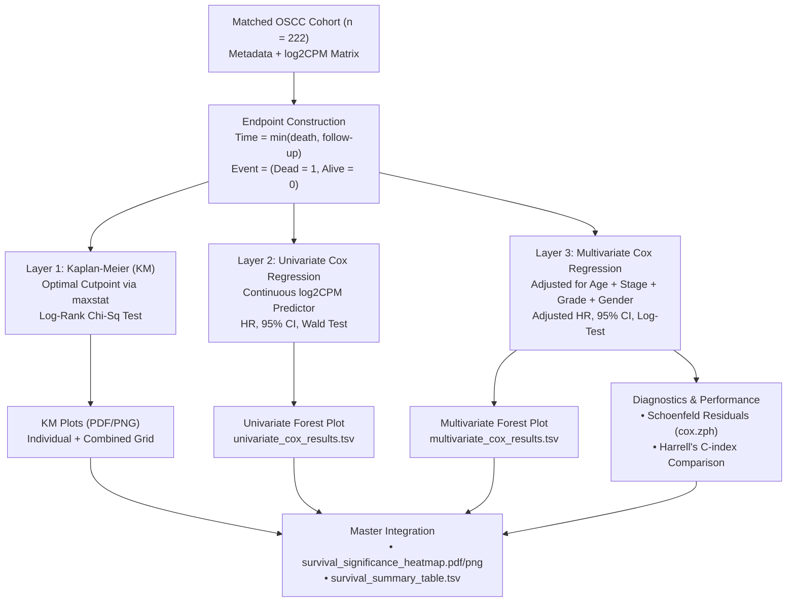

# Survival Association Analysis (Section 2.4) — Comprehensive Methodology Guide
**Project**: PIKK Pathway-Associated Biomarker Discovery in Oral Squamous Cell Carcinoma (OSCC)  
**Dataset**: TCGA-HNSC (Oral Cavity Subset, $n = 222$ patients with matched clinical and transcriptomic data)  
**Script**: [`08_scripts/06_survival_analysis/survival_analysis_hub_genes.R`](file:///c:/Users/dipak/Desktop/Riku/NyberMan/OSCC_PIKK_Project/08_scripts/06_survival_analysis/survival_analysis_hub_genes.R)  
**Output Directory**: [`05_results/survival_outputs/`](file:///c:/Users/dipak/Desktop/Riku/NyberMan/OSCC_PIKK_Project/05_results/survival_outputs/)

---

## 1. Executive Summary

Survival analysis is the statistical gold standard for evaluating whether biological markers (such as hub genes in the PIKK DNA damage response and checkpoint signaling pathways) are significantly linked to clinical patient outcomes.

In Section 2.4 of the OSCC PIKK project, we evaluate **24 identified hub genes** across three rigorous, complementary analytical layers:
1. **Kaplan–Meier (KM) Analysis with Optimal Cutpoint Determination**: Evaluates patient survival curves when stratified into *High* vs. *Low* expression groups.
2. **Univariate Cox Proportional Hazards Regression**: Quantifies the continuous, unadjusted prognostic effect (Hazard Ratio) per unit increase in normalized gene expression ($\log_2\text{CPM}$).
3. **Multivariate Cox Proportional Hazards Regression**: Tests whether the gene's prognostic power remains statistically significant after controlling for key clinical covariates (**Age**, **Pathologic Tumor Stage**, **Histologic Tumor Grade**, and **Gender**).
4. **Model Diagnostics & Discrimination**: Tests the proportional hazards assumption via Schoenfeld residuals and evaluates model predictive accuracy using Harrell's Concordance Index ($C$-index).

---

## 2. Fundamental Concepts of Survival Analysis (A Primer from First Principles)

### 2.1 Why Not Standard Linear Regression or T-Tests?
In standard biomedical experiments, we measure fixed endpoints (e.g., tumor volume after 4 weeks). However, clinical oncology datasets have two unique properties that violate the assumptions of standard linear or logistic regression:
1. **Time-to-Event Nature**: We care not just *whether* a patient died, but *when* they died. A treatment or gene state that extends life by 5 years is clinically superior to one that extends it by 3 months, even if both patients eventually pass away.
2. **Right-Censoring**: At the end of a study, many patients are still alive, or some patients moved away and were lost to follow-up. We know they survived *at least* until their last clinic visit (e.g., 1,500 days), but we do not know their exact death date. Discarding alive patients would severely bias the study towards poor outcomes, while treating their last follow-up as their death date would falsely underestimate survival.

Survival analysis was developed specifically to handle **censored time-to-event data without bias**.

```
Patient 1: ────[Diagnosis]──────────────────────────(Death at Day 450)           → Event = 1, Time = 450
Patient 2: ────[Diagnosis]──────────────────────────────────────[Last Follow-up 1200d] (Alive) → Event = 0, Time = 1200 (Censored)
Patient 3: ────[Diagnosis]────────[Lost to follow-up 300d] (Alive)              → Event = 0, Time = 300  (Censored)
```

---

### 2.2 Mathematical Terminology

#### 1. Survival Time ($T$) and Event Indicator ($\delta$)
For each patient $i$:
- **Time ($T_i$)**: The duration from initial diagnosis to the event or last follow-up.
- **Event Status ($\delta_i$)**:
  $$\delta_i = \begin{cases} 1 & \text{if Event occurred (Death)} \\ 0 & \text{if Censored (Alive at last follow-up)} \end{cases}$$

#### 2. The Survival Function $S(t)$
$S(t)$ represents the probability that a patient survives longer than time $t$:
$$S(t) = P(T > t), \quad \text{where } S(0) = 1 \text{ and } \lim_{t \to \infty} S(t) = 0$$

#### 3. The Hazard Function $h(t)$
$h(t)$ is the instantaneous rate (risk) of experiencing the event at time $t$, conditional on having survived up to time $t$:
$$h(t) = \lim_{\Delta t \to 0} \frac{P(t \le T < t + \Delta t \mid T \ge t)}{\Delta t}$$

---

## 3. Data Preparation and Cohort Construction

The pipeline merges two primary data streams using patient and sample identifiers:
1. **Expression Matrix** (`logCPM_matrix.tsv`): Batch-corrected, $\log_2$-transformed Counts Per Million ($\log_2\text{CPM}$) quantifying RNA abundance for all 24 hub genes.
2. **Clinical Metadata** (`matched_metadata_used.tsv`): Clinical annotations from TCGA-HNSC curated with longitudinal follow-up records.

```
┌────────────────────────────────────────────────────────┐
│ TCGA-HNSC OSCC Samples (n = 240)                       │
└──────────────────────────┬─────────────────────────────┘
                           │ Filter: Condition == "Tumor"
                           │ Deduplicate: 1 sample per patient Case ID
                           ▼
┌────────────────────────────────────────────────────────┐
│ Unique Tumor Patients (n = 222)                        │
├────────────────────────────────────────────────────────┤
│ • Events (Dead): n = 111 (Time = days_to_death)        │
│ • Censored (Alive): n = 111 (Time = days_to_last_fu)   │
└──────────────────────────┬─────────────────────────────┘
                           │ Merge Hub Gene Expression (log2 CPM)
                           ▼
┌────────────────────────────────────────────────────────┐
│ Analytic Survival Cohort (Surv(Time_Years, Event))     │
└────────────────────────────────────────────────────────┘
```

### 3.1 Endpoint Definition
- **Overall Survival (OS)** is selected as the primary endpoint:
  $$\text{OS Time (days)} = \begin{cases} \text{demographic.days\_to\_death} & \text{if } \text{vital\_status} == \text{"Dead"} \\ \text{diagnoses.days\_to\_last\_follow\_up} & \text{if } \text{vital\_status} == \text{"Alive"} \end{cases}$$
- Converted to years for clinical clarity: $\text{OS Time (years)} = \frac{\text{OS Time (days)}}{365.25}$.

---

## 4. Analytical Method 1: Kaplan–Meier (KM) Survival Curves

### 4.1 Concept and Formula
The Kaplan–Meier estimator is a non-parametric statistic used to estimate the survival function $S(t)$ from observed event and censoring times:
$$\hat{S}(t) = \prod_{t_i \le t} \left( 1 - \frac{d_i}{n_i} \right)$$
Where:
- $t_i$: Distinct time of death occurrence.
- $d_i$: Number of deaths occurring exactly at time $t_i$.
- $n_i$: Number of patients known to be alive and at risk just prior to $t_i$.

KM curves produce the iconic **stepped survival graphs**, where vertical drops mark patient deaths and vertical tick marks indicate censored patients.

---

### 4.2 Optimal Cutpoint Determination (Maximally Selected Rank Statistics)
To plot a KM curve for a continuous gene expression value, the patient cohort must be divided into **High** vs. **Low** expression groups. 

- **Traditional approach**: Arbitrary median split ($50\% / 50\%$). While simple, a median split can dilute biologically meaningful signals if only the upper quartile exhibits pathological overexpression.
- **Our implementation**: **Maximally Selected Rank Statistics (`maxstat` / `survminer::surv_cutpoint`)**.
  - The algorithm systematically scans across all observed expression values of gene $g$ between the 25th and 75th percentiles (`minprop = 0.25`).
  - At each candidate threshold $c$, it computes the standardized two-sample log-rank statistic $M(c)$.
  - The optimal threshold $c^*$ is chosen where the separation between survival curves is maximized:
    $$c^* = \arg\max_{c} |M(c)|$$
  - If the optimization does not converge, the script automatically falls back to the median value.

```
       Candidate Cutpoint Evaluation across Expression Spectrum
       ─────────────────────────────────────────────────────────
       Low Exp (< c*)                     High Exp (≥ c*)
       [============== 25% to 75% Search Range ==============]
                               ▲
                               │ Optimal Cutpoint c* (Max Log-Rank Chi-Sq)
```

---

### 4.3 Log-Rank Test
To formally test whether the *High* and *Low* survival curves are statistically distinct, the **Log-Rank Test** compares the observed number of deaths in each group against the expected number under the null hypothesis ($H_0$: no difference in survival):
$$\chi^2 = \sum_{k \in \{\text{Low, High}\}} \frac{(O_k - E_k)^2}{E_k}, \quad \text{df} = 1$$
A $p$-value $< 0.05$ indicates a statistically significant difference in survival duration between the groups.

---

### 4.4 Visual Deliverables (KM)
1. **Individual KM Curves** (`km_plots/KM_<Gene>.pdf` & `.png`):
   - High-contrast two-color palette (`#D7191C` Red for High, `#2B83BA` Blue for Low).
   - $95\%$ Confidence intervals (shaded bands).
   - Median survival crosshairs (dashed horizontal and vertical lines to median survival time).
   - Standardized **Number-at-Risk Tables** beneath each plot tracking patient attrition over time.
2. **Multi-panel Combined Grid** (`km_combined_grid.pdf` & `.png`): Consolidated visual summary showing the top prognostic hub genes side-by-side.

---

## 5. Analytical Method 2: Univariate Cox Proportional Hazards Regression

### 5.1 Why Cox Regression?
While Kaplan–Meier curves require categorizing gene expression into two bins (losing numerical resolution), **Cox Proportional Hazards Regression** evaluates continuous gene expression directly.

### 5.2 Mathematical Formulation
The Cox model specifies the hazard for patient $i$ at time $t$ as:
$$h(t \mid X_i) = h_0(t) \exp(\beta \cdot X_i)$$
Where:
- $h_0(t)$: **Baseline hazard function** (the underlying risk over time when $X = 0$).
- $X_i$: Continuous $\log_2\text{CPM}$ expression of the hub gene for patient $i$.
- $\beta$: Regression coefficient estimated via partial likelihood maximization.

---

### 5.3 Hazard Ratio ($\text{HR}$) Interpretation
The **Hazard Ratio** is defined as $\text{HR} = \exp(\beta)$:
$$\text{HR} = \frac{h(t \mid X + 1)}{h(t \mid X)} = \exp(\beta)$$

$$\begin{array}{ccl}
\hline
\textbf{Hazard Ratio (HR)} & \textbf{Coefficient } (\beta) & \textbf{Biological / Clinical Interpretation} \\
\hline
\text{HR} > 1.0 & \beta > 0 & \textbf{Risk / Unfavorable Biomarker}: Higher expression increases risk of death. \\
\text{HR} < 1.0 & \beta < 0 & \textbf{Protective / Favorable Biomarker}: Higher expression reduces risk of death. \\
\text{HR} = 1.0 & \beta = 0 & \textbf{Neutral}: Gene expression has no association with survival. \\
\hline
\end{array}$$

*Example*: If $\text{PLK1}$ has an $\text{HR} = 1.45$ ($p = 0.002$), each 1-unit increase in $\log_2\text{CPM}$ expression is associated with a **$45\%$ increase in the instantaneous hazard of death**.

---

### 5.4 Univariate Forest Plot (`univariate_forest_plot.pdf` & `.png`)
A publication forest plot visualizes the regression results across all 24 hub genes simultaneously:
- **Diamonds/Points**: Point estimates of the Hazard Ratio ($\text{HR}$).
- **Horizontal Error Bars**: $95\%$ Confidence Intervals ($\text{HR}_{\text{lower}} \text{ to } \text{HR}_{\text{upper}}$).
- **Vertical Dashed Line at $\text{HR} = 1.0$**: The null effect reference line.
  - If the error bar crosses $1.0$, the gene is not statistically significant at $\alpha = 0.05$.
  - If the error bar lies entirely to the right of $1.0$, the gene is a significant risk factor.
  - If the error bar lies entirely to the left of $1.0$, the gene is a significant protective factor.
- **Point Size**: Scaled proportionally to $-\log_{10}(p\text{-value})$.

---

## 6. Analytical Method 3: Multivariate Cox Proportional Hazards Regression

### 6.1 The Confounding Problem
In clinical oncology, older patients or patients diagnosed at advanced tumor stages generally experience worse survival outcomes. If a hub gene happens to be expressed higher in Stage IV tumors, is the poor survival caused by the gene's active biology, or is the gene merely an innocent passenger of late-stage disease?

To answer this, we build a **Multivariate Cox Regression Model** that adjusts for known clinical prognostic factors simultaneously.

---

### 6.2 Model Specification and Covariates
For each hub gene $g$, the multivariate hazard is:
$$h(t \mid X) = h_0(t) \exp\left( \beta_{\text{gene}} \cdot X_{\text{gene}} + \beta_{\text{age}} \cdot \text{Age} + \beta_{\text{stage}} \cdot \text{StageGroup} + \beta_{\text{grade}} \cdot \text{GradeGroup} + \beta_{\text{gender}} \cdot \text{Gender} \right)$$

$$\begin{array}{lll}
\hline
\textbf{Covariate} & \textbf{Variable Type} & \textbf{Coding / Baseline Reference} \\
\hline
\textbf{Gene Expression} & \text{Continuous} & \log_2\text{CPM} \text{ (numeric)} \\
\textbf{Patient Age} & \text{Continuous} & \text{Years at diagnosis (numeric)} \\
\textbf{Tumor Stage} & \text{Binary Factor} & \text{Early (Stage I–II) [Ref] vs. Advanced (Stage III–IV)} \\
\textbf{Tumor Grade} & \text{Binary Factor} & \text{Low Grade (G1–G2) [Ref] vs. High Grade (G3–G4)} \\
\textbf{Gender} & \text{Binary Factor} & \text{Male [Ref] vs. Female} \\
\hline
\end{array}$$

*(Note: Extracted from TCGA-HNSC `diagnoses.tumor_grade`: G1 = Well-differentiated, G2 = Moderately-differentiated, G3 = Poorly-differentiated, G4 = Undifferentiated; dichotomised into Low vs. High grade for clinical robustness).*

---

### 6.3 Adjusted Hazard Ratio ($\text{adj.HR}$)
The adjusted Hazard Ratio $\text{adj.HR} = \exp(\beta_{\text{gene}})$ isolates the **independent prognostic value** of the hub gene:
- If $\text{adj.HR} > 1.0$ and $p_{\text{adj}} < 0.05$, the hub gene is an **independent prognostic biomarker**. Its association with survival is not an artifact of patient age, stage, or gender.

---

## 7. Model Diagnostics and Predictive Performance

### 7.1 Proportional Hazards Assumption (Schoenfeld Residuals)
The fundamental assumption of Cox regression is that the ratio of hazards between groups remains constant over time (i.e., $\beta$ does not change as $t$ increases).

- **Schoenfeld Residual Test (`survival::cox.zph`)**:
  - Computes the correlation between scaled Schoenfeld residuals and transformed time.
  - Null Hypothesis ($H_0$): The hazard ratio is constant over time.
  - A test $p > 0.05$ confirms that the **proportional hazards assumption holds** (valid model).
- **Diagnostic Plots (`cox_ph_diagnostics.pdf` & `.png`)**:
  - Plots $\beta(t)$ over time with a smoothed spline. A flat horizontal line centered on $\beta$ confirms proportionality.

---

### 7.2 Model Discrimination: Harrell's Concordance Index ($C$-index)
The **Concordance Index ($C$-index)** measures the model's ability to correctly rank patient survival times based on predicted risk scores:
$$C = P(\widehat{\text{Risk}}_i > \widehat{\text{Risk}}_j \mid T_i < T_j)$$
For any randomly selected pair of patients where one died before the other, $C$ represents the probability that the model assigned a higher risk score to the patient who died first.

$$\begin{array}{cl}
\hline
\textbf{C-index Value} & \textbf{Predictive Discrimination} \\
\hline
C = 0.50 & \text{Random guess (equivalent to a coin toss)} \\
0.50 < C < 0.60 & \text{Poor discrimination} \\
0.60 \le C < 0.70 & \text{Moderate discrimination} \\
0.70 \le C < 0.80 & \text{Good discrimination} \\
C \ge 0.80 & \text{Strong / Excellent clinical prediction} \\
\hline
\end{array}$$

- **Concordance Comparison Plot (`concordance_comparison.pdf` & `.png`)**: Directly compares $C_{\text{univariate}}$ vs. $C_{\text{multivariate}}$ across all hub genes with $95\%$ error bars to illustrate how adding clinical covariates enhances prognostic accuracy.

---

## 8. Summary of Analytical Outputs and Deliverables

```
05_results/survival_outputs/
├── km_plots/                                  # Folder of individual KM curves
│   ├── KM_PRKDC.pdf / .png
│   ├── KM_BRCA1.pdf / .png
│   ├── KM_PLK1.pdf / .png
│   └── ... (all 24 hub genes)
├── km_combined_grid.pdf / .png                # Multi-panel KM grid for top candidates
├── km_logrank_summary.tsv                     # KM cutpoints, sample sizes, and Log-Rank p-values
├── univariate_cox_results.tsv                 # Univariate Cox HR, 95% CI, Wald p, FDR, C-index
├── univariate_forest_plot.pdf / .png          # Publication-ready forest plot of Univariate HRs
├── multivariate_cox_results.tsv               # Multivariate adjusted HRs, covariate p-values
├── multivariate_forest_plot.pdf / .png        # Publication-ready forest plot of Adjusted HRs
├── multivariate_full_forest_best_gene.pdf/.png# Full covariate breakdown for top candidate
├── concordance_summary.tsv                    # Table of C-index metrics (Univariate vs Multivariate)
├── concordance_comparison.pdf / .png          # Bar chart comparing C-index discrimination
├── cox_ph_diagnostics.pdf / .png              # Schoenfeld residual diagnostic plots
├── survival_significance_heatmap.pdf / .png   # Tri-layer significance heatmap (-log10 p)
└── survival_summary_table.tsv                 # Master table integrating Phase 2 & Survival results
```

---

## 9. Comprehensive Synthesis Table (Master Output)

The script generates `survival_summary_table.tsv`, merging all upstream network metrics from Section 2.3 with the survival metrics from Section 2.4:

| Column Header | Description / Source |
|---|---|
| `gene_symbol` | Official HGNC gene symbol |
| `PIKK_Group` | Associated PIKK kinase family (ATR, ATM, PRKDC, MTOR, TRRAP, SMG1) |
| `GeneRole` | Core PIKK member vs. Associated Pathway Interactor |
| `regulation` | Dysregulation direction in tumor vs. normal tissue (Up / Down / Not sig) |
| `log2FoldChange` | Differential expression magnitude from edgeR |
| `pathway_role` | Functional role (DNA Repair Effector, Checkpoint Regulator, etc.) |
| `composite_score` | Centrality composite score from PPI network analysis |
| `cutpoint` | Optimal expression threshold ($\log_2\text{CPM}$) from `maxstat` |
| `logrank_p` | Statistical significance of KM curve separation |
| `uni_HR` & `uni_p` | Hazard ratio and $p$-value from continuous univariate Cox regression |
| `mv_HR` & `mv_p` | Adjusted Hazard ratio and $p$-value from multivariate Cox regression |
| `mv_Cindex` | Harrell's $C$-index for the full multivariate model |
| `survival_significant` | Integrated status: *"Yes (univariate)"*, *"Yes (multivariate only)"*, *"Yes (KM only)"*, or *"No"* |

---

## 10. Summary Flowchart


